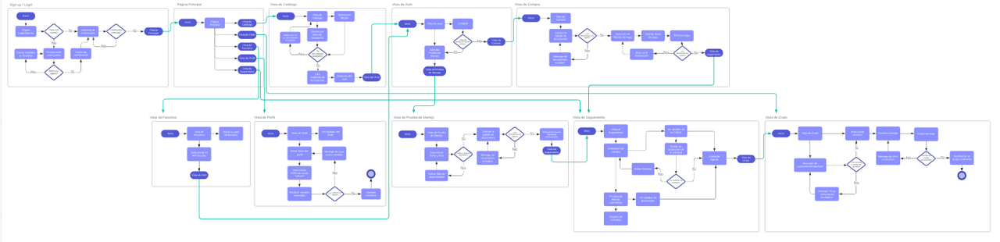

  

<h2 align="center"> Completa Digitalización del Proceso de Adquisición de un Vehículo 

<h2 align="center"> Software 
Requirements Specification

<h2 align="center"> Versión 0.3

| Date           | Version       | Description  |  
| -------------  |:-------------:| :----------- |
| 26/02/2023     | 0.1           | Creación del Doc SRS|                          
| 01/03/2023     | 0.2           | Doc en Markdown|      
| 07/03/2023     | 0.3           | Avance Significativo|      

<h2 align="center"> Authors
<h3 align="center"> Andreína Sanánez
<h3 align="center"> Karla Mondragón
<h3 align="center"> Mateo Herrera 
<h3 align="center"> Regina Rodríguez
<h3 align="center"> Salvador Milanés

<h1 align="center"> Software Requirements Specification

# Índice
1. [Introducción](#1-introducción)
        
    1.1. [Propósito](#11-propósito)

    1.2. [Enfoque y Alcance](#12-enfoque-y-alcances)

    1.3. [Objetivos SMART](#13-objetivos-smart)

    1.4. [Definiciones, Acrónimos y Abreviaciones](#14-definiciones-acrónimos-y-abreviaciones)

    1.5. [WBS](#15-wbs)

2. [Descripción General](#2-descripción-general)

    2.1. [Clases de Usuarios y Características](#21-clases-de-usuarios-y-características)

    2.2. [Ambiente de Desarrollo](#22-ambiente-de-desarrollo)

    2.2.1. [Diagrama de Arquitectura](#221-diagrama-de-arquitectura)

    2.2.2. [Stack Tecnológico](#222-stack-tecnológico)

    2.2.3. [Diagrama del Tech Stack](#223-diagrama-del-tech-stack)

    2.3. [Restricciones](#23-restricciones)

    2.4. [Suposiciones y Dependencias](#24-suposiciones-y-dependencias)

3. [Características del Sistema](#3-características-del-sistema)

    3.1. [Requerimientos Funcionales](#31-requerimientos-funcionales)

    3.2. [Requerimientos No Funcionales](#32-requerimientos-no-funcionales)

    3.3. [Diagrama de Procesos](#33-diagrama-de-procesos)

# 1. Introducción 

 El objetivo de este documento es recopilar, analizar y brindar una visión profunda de la aplicación web para NDS Cognitive Labs, definiendo el problema y la solución en detalle. El documento también concentra las capacidades requeridas por todos los stakeholders y sus necesidades definiendo las características del producto.

 Nuestra misión para este proyecto es hacer el proceso de compra de un auto de la forma más fácil y conveniente para el usuario haciéndolo completamente en línea.Esto planeamos lograrlo creando una plataforma confiable, transparente y de fácil acceso en la que los clientes puedan tomar decisiones informadas basadas en información confiable y recomendaciones profesionales. Nuestro compromiso con nuestros clientes es ofrecerles una gama variada de autos a través de agencias y grupos automotrices previamente verificadas en nuestra plataforma.

 Con respecto a nuestra visión, buscamos transformar radicalmente el sector de ventas de autos. Con este proyecto queremos que la experiencia tradicional de la compra de autos cambie por completo y sea de una manera completamente digital y sin estrés. Estamos comprometidos a crear una comunidad confiable de vendedores y compradores donde las transacciones pueden ser completamente en línea, quitando los problemas e inconvenientes asociados a la compra tradicional de autos. 

## 1.1. Propósito

 El propósito del documento es recopilar y analizar todas las ideas que han surgido para definir el sistema y sus requisitos con respecto a los usuarios que harán uso de la aplicación. 

 En este proyecto en colaboración con NDS Cognitive Labs, se busca la completa digitalización del proceso de adquisición de vehículos nuevos y seminuevos. La problemática que se busca resolver es agilizar un proceso que se ha vuelto inconveniente y tedioso: la compra de un vehículo. Dicho proceso presenta múltiples inconvenientes desde que no todas las agencias tienen el catálogo completo de autos disponibles hasta la cercanía entre las agencias y el comprador. Nuestra propuesta busca:
<ul>
    <li> La completa transparencia en los procesos de compra 
    <li> Un diseño intuitivo y funcional
    <li> Un proceso de compra amigable y conveniente
    <li> La completa protección de datos de usuarios
</ul>

## 1.2. Enfoque y Alcances

 Por medio de una aplicación web que fomente la convivencia entre diferentes agencias, grupos automotrices y marcas se espera que el usuario sea capaz de elegir un vehículo desde un amplio catálogo, encuentre planes de financiamiento que se adapten a sus necesidades y que cuente con una plataforma con diversas formas de pago. El usuario puede solicitar una prueba de manejo si así lo desea y comprar su vehículo en cualquier agencia disponible y puede comunicarse con una agencia (vendedor específico) por medio de un chat en tiempo real.

 Nuestra aplicación busca habilitar permisos de usuarios y roles administrativos. La plataforma permitirá a usuarios administradores subir catálogos de autos y a sus clientes navegar los mismos. Los clientes también serán capaces de subir los documentos legales requeridos y toda la información solicitada estará encriptada y protegida. La plataforma tendrá una interfaz intuitiva para que los usuarios puedan buscar y filtrar autos de un catálogo, comparar opciones seleccionadas y ver sus especificaciones.

 Lo que nos diferencia de la competencia es nuestra intención de crear un simulador Comparativo de autos, dar recomendaciones personalizadas con Machine Learning y la implementación de un "Wishlist" (Bookmark de autos preferidos). Algunos aspectos de la solución que nosotros como HumanIT Consulting no cubriremos son el mantenimiento de la aplicación, el servicio y patrocinio del almacenamiento en Cloud y la solución de quejas acerca de la manufactura o el estado de los automóviles.

## 1.3. Objetivos SMART
1. _Mejorar la experiencia del usuario:_ para fines de junio 2023, con el lanzamiento de la aplicación, buscamos reducir a la mitad, el tiempo que le toma a un usuario finalizar la compra de un automóvil en la plataforma acelerando el proceso de pago y mejorando la interfaz de usuario.
2. _Mejorar el servicio al cliente:_ para mediados de abril 2023, se busca implementar un chatbot que pueda ofrecer ayuda las 24 horas, los 7 días de la semana y reducir a la mitad los tiempos de respuesta a las consultas de los clientes. Esto mejorará el servicio al cliente en la plataforma.
3. _Aumentar las opciones de pago:_ para fines de mayo de 2023, se busca incluir una pasarela de pago que acepte más formas de pago para ampliar la cantidad de alternativas de pago disponibles para los clientes en la plataforma.
4. _Aumentar el posicionamiento en los motores de búsqueda:_ para fines de mayo de 2023, se utilizarán mejores prácticas de optimización de motores de búsqueda para aumentar el ranking de la plataforma.
5. _Mejorar la seguridad de la plataforma:_ para evitar violaciones de datos y garantizar la privacidad del consumidor, se agregara autenticación y la verificación de autorización y se incluirá el cifrado de datos para fines de abril de 2023. 
6. _Implemente análisis predictivos:_ uso de análisis predictivo para fines de junio de 2023 con el objetivo de estudiar los datos de los clientes y ofrecer sugerencias de automóviles individuales, lo que lleva a un aumento en la satisfacción del cliente.

## 1.4. Definiciones, Acrónimos y Abreviaciones
| Concepto   | Descripción       |  
| :---------:|:-------------     | 
| SQL        | Structured Query Language, lenguaje de programación para almacenar y procesar información en una base de datos relacional|                           
| API        | Application Programming Interface, conjunto de definiciones y protocolos que se usa para diseñar e integrar el software de las aplicaciones|      
| BD o DB    | Base de Datos o Database|   
| AWS        | Amazon Web Services, colección de servicios de computación en la nube pública que en conjunto forman una plataforma de computación en la nube, ofrecidas a través de Internet por Amazon.com|  
| Stack Tecnológico | Ecosistema tecnológico, conjunto de lineamientos, servicios y softwares que componen un aplicación |

## 1.5. WBS
1. Versión 1: https://github.com/MateoHerrera0/HUMANIT/blob/main/Documentaci%C3%B3n/WBS%20-%20V1.pdf

# 2. Descripción General
## 2.1. Clases de Usuarios y Características
1. _Usuario Comprador_  
* Usuario que usa la plataforma con el propósito de adquirir un vehículo. 
* No tiene ningún permiso de tipo administrador como todos los demás usuarios.
* Tiene una cuenta, perfil y la posibilidad de realizar una transacción monetaria.
2. _Usuario Vendedor_
* Primer usuario de tipo administrador, tiene el menor número de privilegios; solamente se le permite acceder a su información y a la de sus clientes.
* Tiene una cuenta y un perfil.
* Sus permisos y accesos son asignados por un usuario gerente o agencia.  
3. _Usuario Gerente_
* Usuario administrador, sus permisos y acceso es gestionado por el usuario agencia.
* Se le permite acceder a la información de sus vendedores y los clientes de su sucursal correspondiente. 
* Tiene una cuenta y un perfil.
4. _Usuario Agencia_
* Usuario administrador, sus permisos y acceso es gestionado por el usuario grupo automotriz. Gestiona al usuario gerente y junto con el, se gestionan los usuarios vendedores. 
* Se le permite acceder a la información de sus gerentes, vendedores, vehículos y los clientes de la agencia. Dentro de los usuarios de la agencia, es el que más privilegios tiene. 
* Tiene una cuenta y un perfil.
5. _Usuario Grupo Automotriz_
* Usuario administrador, sus permisos y acceso es gestionado por el usuario super-administrador.
* Se le permite acceder a la información de todas las agencias bajo su supervisión, sus catálogos y vehículos, gerentes y vendedores. 
* Gestiona que sucursales serán parte de la plataforma en conjunto con el usuario super-administrador. 
* Tiene una cuenta y un perfil.
6. _Usuario Super-Administrador_  
* Usuario con mayor número de privilegios, su acceso y permisos son gestionados por NDS y los desarrolladores. Es el responsable de gestionar a los usuarios grupo automotriz. 
* Puede acceder a la información de los grupos, agencias, ventas, catálogos y vehículos, al igual que a la información del comportamiento de la plataforma. 
* Tiene una cuenta y un perfil.

## 2.2. Ambiente de Desarrollo
La aplicación se desarrolló en los sistemas operativos de Windows 11 y MacOS Big Sur. 

### 2.2.1. Diagrama de Arquitectura
1. Versión 1: https://github.com/MateoHerrera0/HUMANIT/blob/main/Documentaci%C3%B3n/Architecture%20Diagram.drawio.png

    

 
  
Componentes:

1. Route53: Servicio de DNS proporcionado por AWS.
2. AWS Shield: Servicio de protección ante ataques DDoS proporcionado por AWS.
3. WAF: Firewall de aplicaciones web de AWS. Contiene preconfiguraciones de reglas que protegen ante los top 10 riesgos de seguridad según OWASP.
4. CloudFront. Servicio de CDN (cloud distribution network) proporcionado por AWS. Hace uso de edge locations (caches) para generar conexiones más rápidas. CloudFront también encripta la comunicación entre el servidor y cliente.
5. Elastic Load Balancer: Servicio de AWS que automáticamente distribuye el tráfico entrante a diferentes destinos (EC2). Si una instancia de EC2 tiene mucho tráfico, este servicio automáticamente redirige a usuarios entrantes a otras instancias para generar un mejor desempeño de la aplicación.
6. Auto Scaling Group: Servicio de AWS que permite la creación automática de nuevas instancias de EC2 si se requiere en relación al tráfico entrante, y las destruye cuando no se necesiten. Esto ayuda a la escalabilidad del sistema.
7. Web Server (EC2): Máquina virtual EC2  encargada del despliegue del front-end.
8. App Server (EC2): Máquina virtual EC2 encargada del despliegue del back-end.
9. Elasticache: Caché de base de datos proporcionada por AWS. Queries de información frecuentemente utilizadas suceden dentro del caché, ayudando al rendimiento de la aplicación.
10. mySQL: Base de datos relacional.
11. MongoDB: Base de datos no relacional.
12. Rekognition (Opcional): Servicio de computer vision de AWS capaz de detectar contenido inapropiado, texto y biométricos en imágenes y videos.
13. Textract (Opcional):  Servicio de OCR proporcionado por AWS  capaz de extraer texto de documentos.
14. S3 Bucket for media: Bucket para almacenamiento de documentos e imágenes de la aplicación web
15. S3 Bucket for ECD & DB backup: Bucket para almacenamiento de copias de seguridad de instancias EC2 y bases de datos.
16. CloudWatch: Servicio de monitor cloud de AWS.
17. IAM: Servicios de autorización y autenticación configurables dentro de AWS.

### 2.2.2. Stack Tecnológico 
1. Software Development IDE

_Visual Studio Code:_
* Gratuito - Open Source.
* Los programadores cuentan con conocimiento y experiencia previa.
* Compatible con diversos OS.
* Gran compatibilidad con extensiones/plugins de herramientas externas.
* Intuitivo de utilizar.

2. Database

_MySQL Community Edition (Almacenamiento de Cuentas):_
* Gratuito - GPL Licence.
* Los programadores cuentan con conocimiento y experiencia previa.
* Compatible con diversos OS - compatible con Windows. 
* Cuenta con capas de seguridad.
* Estructura relacional -  bueno para almacenar relaciones como aquellas en los diferentes tipos de cuentas definidas para la plataforma.
* Cuenta con una buena comunidad, documentación y material de consulta para su utilización.

_MongoDB (Almacenamiento de catálogo e información de la compra):_
* Gratuito.
* Los programadores cuentan con conocimiento y experiencia previa.
* Compatible con diversos OS - compatible con Windows. 
* Fácil instalación e implementación. 
* Altamente flexible y escalable.
* Tolera grandes volúmenes de datos.
* Estructura no relacional - bueno para manejar muchas read-write operations como lo son búsquedas, filtrado e información referente a la compra del auto.
* Cuenta con una buena comunidad, documentación y material de consulta para su utilización.

3. Dev. Environments

_NodeJS (Application Layer):_
* Gratuito - Open Source.
* Los programadores cuentan con conocimiento y experiencia previa.
* Compatibilidad cross-platform - gran compatibilidad con React.
* Facilita el desarrollo del backend en JavaScript.
* Particularmente rápido y escalable al estar construido sobre Chrome V8 Engine.
* Cuenta con una buena comunidad, documentación y material de consulta para su utilización.

4. Frameworks

_Express:_
* Gratuito - Open Source.
* Framework derivado de NodeJS y por ende compatible.
* Los programadores cuentan con conocimiento y experiencia previa.
* Provee un conjunto de herramientas que facilitan la creación del backend/API con NodeJS.
* Cuenta con una buena comunidad, documentación y material de consulta para su utilización.

5. Front-end Development Libraries

_React (JavaScript):_
* Gratuito - Open Source
* Los programadores cuentan con conocimiento y experiencia previa.
* Permite programación por componentes haciendo fácil reutilización y mantenimiento de código para la implementación de la funcionalidad y renderizado del front-end.
* Utiliza virtual DOM lo cual aumenta su rendimiento al permitir que cierta información se maneje y esté disponible “client-side”.
* Cuenta con una buena comunidad, documentación y material de consulta para su utilización.

6. Cascading Style Libraries

_Bootstrap:_
* Gratuito.
* Los programadores cuentan con conocimiento y experiencia previa.
* Opera en base a un “Grid System” con elementos pre-desarrollados que ahorran tiempo y esfuerzo al momento de realizar el estilo.
* A comparación de otras opciones que dan más libertad, con Bootstrap es sumamente rápido el desarrollo del UI.
* Cuenta con una buena comunidad, documentación y material de consulta para su utilización.

7. Cloud Service

_AWS - Academy Trial:_
* Se cuenta con 100 USD de crédito por cada integrante (2,000 USD).
* Los programadores cuentan con conocimiento y experiencia previa.
* Altamente escalable y confiable.
* Ofrece un amplio rango de herramientas y servicios.
* Proporciona un alto nivel de seguridad necesaria para la documentación legal y otra información confidencial manejada en la compra de un auto.

8. Payment Gateway Integration

_Stripe:_
* Comisión de 2.9% + 30 centavos por cada transacción.
* API fácil y rápida de utilizar/integrar con otra plataforma.
* Soporta una amplia variedad de monedas y métodos de pago.
* Proporciona un sistema seguro de pago.
* Cuenta con servicio al cliente 24/7 ya sea vía teléfono, email o live chat.
* Cuenta con una buena comunidad, documentación y material de consulta para su utilización.

9. Source Control

_GitHub:_
* Gratuito.
* Todos los programadores han utilizado y conocen extensamente la herramienta.
* Permite repositorios ilimitados - lo cual da versatilidad a la organización que se tome para la realización del proyecto.
* Permite administrar de forma sencilla y organizada controlar la colaboración, actualizaciones y cambios que se realicen al proyecto por parte de todos los miembros del equipo.
* Cuenta con una buena comunidad, documentación y material de consulta para su utilización.

10. Browsers
* Firefox
* Chrome
* Safari
* Edge

### 2.2.3. Diagrama del Tech Stack
A continuación se encuentra la visualización gráfica del Tech Stack de la solución.  
Link al diagrama: https://www.figma.com/file/yLADWuGigqfuYnZxik1LG7/Tech-Stack-Diagram-(Copy)?node-id=0%3A1&t=aLeCQBq4z7graTVD-1

  

## 2.3. Restricciones
1. Solamente se aceptan grupos automotrices y agencias como participantes en la plataforma, no individuos. 
2. Uso de Cloud requerido, SaaS. 
3. HumanIT Consulting no proveera mantenimiento a la aplicación.

## 2.4. Suposiciones y Dependencias

# 3. Características del Sistema
## 3.1. Requerimientos Funcionales

## 3.2. Requerimientos No Funcionales

## 3.3. Diagrama de Procesos
Versión 1: https://lucid.app/lucidchart/f537bb12-606e-4b78-aa77-da29f215a0ba/edit?viewport_loc=49%2C-44%2C5353%2C2575%2C3B0CRSot8otI&invitationId=inv_fc08b46c-fb27-4142-98ad-536a40099759
  

    

 

# 4. Modelo de Datos
## 4.1. Diagramas de Casos de Uso
## 4.2. Diagrama Entidad-Relación 

# 5. Interfaces
## 5.1. Diagrama de Procesos 
## 5.2. Wireframe 
  

