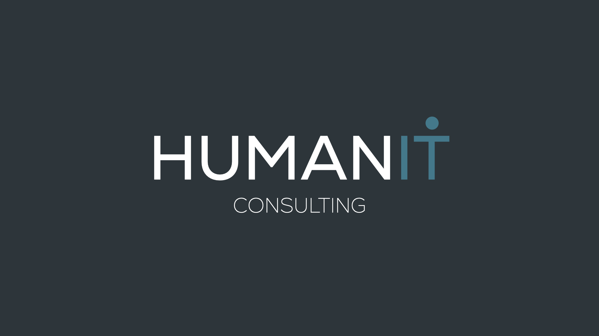

  

# 

## Our Vision
At HumanIT consulting company, our vision is to be a trusted partner for businesses seeking to navigate the ever-evolving technological landscape. We strive to help organizations leverage technology to improve their efficiency, productivity, and profitability. Our goal is to become the go-to source for software solutions that deliver tangible and succesfull outcomes. We focus on building long-term relationships with our clients by understanding their unique challenges, and providing customized software solutions that meet their specific needs. We are committed to staying at the forefront of the latest trends and technologies in the software industry, so that we can provide our clients with the most innovative and effective solutions possible. 

## Our Mission
Our mission is to empower businesses to achieve their goals through technology. We know that every organization has unique challenges and opportunities, and that the right software solutions can unlock their full potential. Our team of experienced consultants work closely with our clients to understand their needs, goals, and constraints in order to develop customized software solutions that address their specific requirements. We are committed to delivering high-quality software that is scalable, flexible, reliable and that can adapt to the changing needs of our clients. Our mission is to help our clients achieve success through technology, and to be a trusted partner throughout their digital journey.

## Our Values

## Our Corporate Image
In this section we present the logo and corporate images of our consulting compamy HumanIT.

