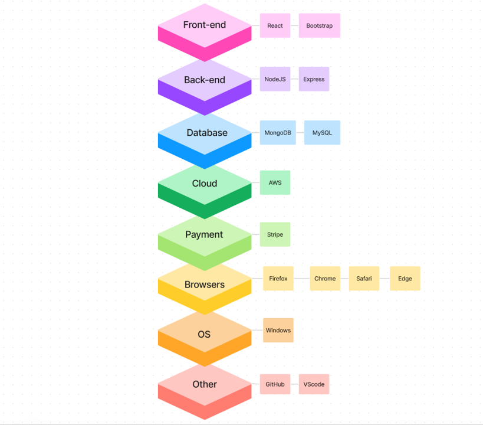
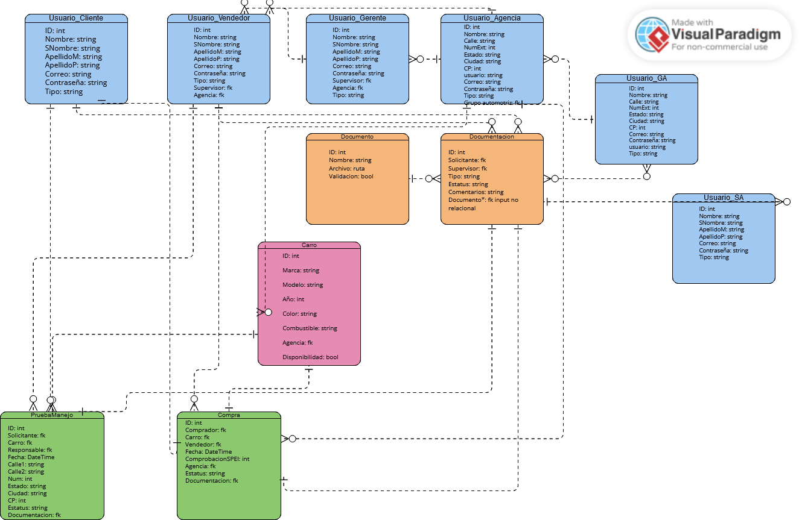

  

<h2 align="center"> Digitalización del Proceso de Adquisición de un Vehículo 

<h2 align="center"> Software 
Requirements Specification

<h2 align="center"> Versión 0.3

| Date       | Version | Description  |  
|------------|:-------:| :----------- |
| 26/02/2023 | 0.1     | Creación del Doc SRS|                          
| 01/03/2023 | 0.2     | Doc en Markdown|      
| 07/03/2023 | 0.3     | Avance Significativo|     
| 12/03/2023 | 1       | Primer Entrega |

<h2 align="center"> Authors
<h3 align="center"> Andreína Sanánez
<h3 align="center"> Karla Mondragón
<h3 align="center"> Mateo Herrera 
<h3 align="center"> Regina Rodríguez
<h3 align="center"> Salvador Milanés

<h1 align="center"> Software Requirements Specification

# Índice
1. [Introducción](#1-introducción)
        
    1.1. [Propósito](#11-propósito)

    1.2. [Convenciones del Documento](#15-convenciones-de-documento)

    1.3. [Enfoque y Alcance](#12-enfoque-y-alcances)

    1.4. [Objetivos SMART](#13-objetivos-smart)

    1.5. [Referencias](#16-referencias)

2. [Descripción General](#2-descripción-general)

    2.1. [Pespectiva del Producto](#21-perspectiva-del-producto)

    2.2. [Clases de Usuarios y Características](#22-clases-de-usuarios-y-características)

    2.3. [Ambiente de Desarrollo](#23-ambiente-de-desarrollo)

    2.4. [Restricciones del Diseño e Implementación](#24-restricciones-de-implementación-y-diseño)

    2.5. [Suposiciones y Dependencias](#25-suposiciones-y-dependencias)

3. [Características del Sistema](#3-características-del-sistema)

    3.1. [Requerimientos Funcionales](#31-requerimientos-funcionales)

    3.2. [Requerimientos No Funcionales](#32-requerimientos-no-funcionales)

    3.3. [Diagrama de Casos de Uso](#33-diagramas-de-casos-de-uso)

4. [Requerimientos de Datos](#4-requerimientos-de-datos) 

    4.1. [Modelo de Datos Lógico: Diagrama Entidad-Relación](#41-modelo-de-datos-lógico-diagrama-entidad-relación)

    4.2. [Diccionario de Datos](#42-diccionario-de-datos)

    4.3. [Reportes](#43-reportes)

    4.4. [Adquisición, Integridad, Retención y Eliminación de Datos](#44-adquisición-de-datos-integridad-retención-y-eliminación)  

5. [Requerimientos de Interfaces Externas](#5-requerimientos-de-interfaces-externas)

    5.1. [Interfaces de Usuario](#51-interfaces-de-usuario)

    5.2. [Interfaces de Software](#52-interfaces-de-software)

    5.3. Interfaces de Hardware (N/A)

    5.4. [Interfaces de Comunicación](#54-interfaces-de-comunicación)

6. [Atributos de Calidad](#6-atributos-de-calidad)

    6.1. [Usabilidad](#61-usabilidad)

    6.2. [Rendimiento](#62-rendimiento)

    6.3. [Seguridad](#63-seguridad)

    6.4. [Protección](#64-protección)

7. [Internacionalización y Ubicación de Requerimientos](#7-internacionalización-y-ubicación-de-requerimientos)

8. Otros Requerimientos (N/A)

9. [Apéndices](#9-apéndices)

    9.1. [WBS](#1-wbs)

    9.2. [Gantt](#2-gantt)

    9.3. [Budget and Effort Analysis](#3-budget-and-effort-analysis)

    9.4. [Historias de Usuario](#4-historias-de-usuario)

    9.5. [Administración de Riesgos](#5-administración-de-riesgos) 

# 1. Introducción 

 El objetivo de este documento es recopilar, analizar y brindar una visión profunda de la aplicación web para NDS Cognitive Labs, definiendo el problema y la solución en detalle. El documento también concentra las capacidades requeridas por todos los stakeholders y sus necesidades definiendo las características del producto.

 Nuestra misión para este proyecto es hacer el proceso de compra de un auto más fácil y conveniente para el usuario digitalizando dicho proceso. Esto planeamos lograrlo creando una plataforma confiable, transparente y de fácil acceso en la que los clientes puedan tomar decisiones informadas basadas en información confiable y recomendaciones profesionales. Nuestro compromiso con nuestros clientes es ofrecerles una gama variada de autos a través de agencias y grupos automotrices previamente verificadas en nuestra plataforma. El problema que nuestra propuesta busca solucionar lo inconventiente que se ha vuelto el proceso de adquisición de un vehículo, tanto para las agencias que no tienen acceso a un equipo de TI como para los compradores que pueden tardar meses en el proceso.

 Con respecto a nuestra visión, buscamos transformar radicalmente el sector de ventas de autos. Con este proyecto queremos que la experiencia tradicional de la compra de autos cambie, se adapte a las nuevas tecnologías y no estrese a los usuarios. Estamos comprometidos a crear una comunidad confiable de vendedores y compradores donde las transacciones puedan ser en línea, quitando los problemas e inconvenientes asociados a la compra tradicional de autos. 

## 1.1. Propósito

 El propósito del documento es recopilar y analizar todas las ideas que han surgido para definir el sistema y sus requisitos con respecto a los usuarios que harán uso de la aplicación. 

 En este proyecto en colaboración con NDS Cognitive Labs, se busca la digitalización del proceso de adquisición de vehículos nuevos y seminuevos. La problemática que se busca resolver es agilizar un proceso que se ha vuelto inconveniente y tedioso: la compra de un vehículo. Dicho proceso presenta múltiples inconvenientes desde que no todas las agencias tienen el catálogo completo de autos disponibles hasta la cercanía entre las agencias y el comprador. Nuestra propuesta busca:
<ol>
    <li> Transparencia en los procesos de compra 
    <li> Un diseño intuitivo y funcional
    <li> Un proceso de compra amigable y conveniente
    <li> La protección de datos de usuarios
</ol>

## 1.2. Enfoque y Alcances
Por medio de una aplicación web que fomente la convivencia entre diferentes agencias, grupos automotrices y marcas se espera que el usuario sea capaz de:
1. Elegir un vehículo desde un amplio catálogo, 
2. Encuentre planes de financiamiento que se adapten a sus necesidades,  
4. Solicitar una prueba de manejo si así lo desea, 
5. Comprar su vehículo en cualquier agencia disponible,
6. Comunicarse con una agencia (vendedor específico) por medio de un chat en tiempo real,
7. Subir los documentos legales requeridos.

Nuestra aplicación busca: 
1. Habilitar permisos de usuarios y roles administrativos, 
2. Permitir a usuarios administradores subir catálogos de autos y a sus clientes navegar los mismos,
3. Tener una interfaz intuitiva para que los usuarios puedan buscar y filtrar autos de un catálogo, 
4. Comparar opciones seleccionadas y ver sus especificaciones,
5. Tener una plataforma con diversas formas de pago, 
6. Que la información solicitada estará cifrada y protegida.

Lo que nos distingue de la competencia es nuestra intención de:
1. Crear un simulador comparativo de autos, 
2. Dar recomendaciones personalizadas con Machine Learning y 
3. La implementación de un "Wishlist" (Bookmark de autos preferidos).  
Pero, priorizando la entrega de un MVP funcional, de calidad y que cubra las necesidades del cliente, NDS. 

Algunos aspectos de la solución, que quedan mas allá de nuestra propuesta como HumanIT Consulting son el mantenimiento de la aplicación, el servicio y hospedaje para el almacenamiento en Cloud y la solución de quejas acerca de la manufactura o el estado de los automóviles.

## 1.3. Objetivos SMART
1. _Mejorar la experiencia del usuario:_ al terminar el proyecto, con el lanzamiento de la aplicación, buscamos reducir aproximadamente un 30% el tiempo que le toma a un usuario comparar y adquirir un automóvil.
2. _Mejorar el servicio al cliente:_ dentro del desarrollo del proyecto (75%), se busca implementar un chatbot que pueda ofrecer ayuda a los clientes para así reducir hasta en un 50% los tiempos de respuesta. Esto mejorará el servicio al cliente en la plataforma.
3. _Aumentar las opciones de pago:_ al terminar el proyecto, con el lanzamiento de la aplicación, se busca incluir una pasarela de pago que acepte diversas formas de pago para ampliar la cantidad de alternativas para los clientes en la plataforma.
4. _Aumentar el posicionamiento en los motores de búsqueda:_ al terminar el proyecto, con el lanzamiento de la aplicación, se pretende utilizar mejores prácticas de optimización de motores de búsqueda para aumentar el ranking de la plataforma.
5. _Mejorar la seguridad de la plataforma:_ para evitar violaciones de datos y proteger la privacidad del consumidor, se agregara autenticación y la verificación de autorización y se incluirá el cifrado de datos dentro del desarrollo del proyecto (80%). 
6. _Implemente análisis predictivos:_ al terminar el proyecto, con el lanzamiento de la aplicación (si existen recursos disponibles), se pretende mejorar el uso de análisis predictivo con el objetivo de estudiar los datos de los clientes y ofrecer sugerencias de automóviles individuales, lo que lleva a un aumento en la satisfacción del cliente.

## 1.4. Convenciones de Documento
| Concepto   | Descripción       |  
| :---------:|:-------------     | 
| SQL        | Structured Query Language, lenguaje de programación para almacenar y procesar información en una base de datos relacional|                           
| API        | Application Programming Interface, conjunto de definiciones y protocolos que se usa para diseñar e integrar el software de las aplicaciones|      
| BD o DB    | Base de Datos o Database|   
| AWS        | Amazon Web Services, colección de servicios de computación en la nube pública que en conjunto forman una plataforma de computación en la nube, ofrecidas a través de Internet por Amazon.com|  
| Stack Tecnológico | Ecosistema tecnológico, conjunto de lineamientos, servicios y softwares que componen un aplicación |

## 1.5. Referencias
"IEEE Guide for Software Requirements Specifications," in IEEE Std 830-1984 , vol., no., pp.1-26, 10 Feb. 1984, doi: 10.1109/IEEESTD.1984.119205. https://ieeexplore.ieee.org/document/278253

# 2. Descripción General
## 2.1. Perspectiva del Producto
La aplicación busca ser un servicio e-commerce donde un usuario comprador tenga la oportunidad de comprar un vehículo de forma intuitiva, amigable, segura y digital. NDS Cognitive Labs es una consultora internacional especializada en el diseño y desarrollo de soluciones de software de tiempo real que van desde Inteligencia Artificial a Nube. 

La idea del servicio pretende trabajar con tecnologías emergentes para facilitar el proceso de adquisión de un vehículo de agencia.

## 2.2. Clases de Usuarios y Características

1. _Usuario Comprador_  
  * Usuario que usa la plataforma con el propósito de adquirir un vehículo. 
  * No tiene ningún permiso de tipo administrador como todos los demás usuarios.
  * Tiene una cuenta, perfil y la posibilidad de realizar una transacción monetaria.
2. _Usuario Vendedor_
  * Primer usuario de tipo administrador, tiene el menor número de privilegios; solamente se le permite acceder a su información y a la de sus clientes.
  * Tiene una cuenta y un perfil.
  * Sus permisos y accesos son asignados por un usuario gerente o agencia.  
3. _Usuario Gerente_
  * Usuario administrador, sus permisos y acceso es gestionado por el usuario agencia.
  * Se le permite acceder a la información de sus vendedores y los clientes de su sucursal correspondiente. 
  * Tiene una cuenta y un perfil.
4. _Usuario Agencia_
  * Usuario administrador, sus permisos y acceso es gestionado por el usuario grupo automotriz. Gestiona al usuario gerente y junto con el, se gestionan los usuarios vendedores. 
  * Se le permite acceder a la información de sus gerentes, vendedores, vehículos y los clientes de la agencia. Dentro de los usuarios de la agencia, es el que más privilegios tiene. 
  * Tiene una cuenta y un perfil.
5. _Usuario Grupo Automotriz_
  * Usuario administrador, sus permisos y acceso es gestionado por el usuario super-administrador.
  * Se le permite acceder a la información de todas las agencias bajo su supervisión, sus catálogos y vehículos, gerentes y vendedores. 
  * Gestiona que sucursales serán parte de la plataforma en conjunto con el usuario super-administrador. 
  * Tiene una cuenta y un perfil.
6. _Usuario Super-Administrador_  
  * Usuario con mayor número de privilegios, su acceso y permisos son gestionados por NDS y los desarrolladores. Es el responsable de gestionar a los usuarios grupo automotriz. 
  * Puede acceder a la información de los grupos, agencias, ventas, catálogos y vehículos, al igual que a la información del comportamiento de la plataforma. 
  * Tiene una cuenta y un perfil.

## 2.3. Ambiente de Desarrollo

 En esta sección, se define el Tech Stack diseñado para la solución que se presenta en este escrito. Como se observa a continuación, dese el IDE de desarrollo de software hasta los navegadores utilizados para acceder al sitio, cada herramienta se ha seleccionado cuidadosamente en función de sus características y compatibilidad con el sistema global.
Posteriormente, se describen las ventajas particulares de cada una de estas tecnologías que justifican su elección para la implementación de la solución. De manera específica, se examinan las ventajas de utilizar Visual Studio Code como IDE, MySQL Community Edition para el almacenamiento de cuentas y MongoDB para el almacenamiento de catálogos e información de compra. Además, se exploran las ventajas de utilizar NodeJS para la capa de aplicación, Express para el desarrollo backend, React para el desarrollo front-end y Bootstrap para las bibliotecas de estilo en cascada. Finalmente, se propone el uso de AWS para los servicios en la nube, Stripe para la integración de la pasarela de pago y GitHub para el control de código fuente. 
  
<b>1. Software Development IDE</b>

_Visual Studio Code:_
* Gratuito - Open Source.
* Los programadores cuentan con conocimiento y experiencia previa.
* Compatible con diversos OS.
* Gran compatibilidad con extensiones/plugins de herramientas externas.
* Intuitivo de utilizar.

<b>2. Database</b>

_MySQL Community Edition (Almacenamiento de Cuentas):_
* Gratuito - GPL Licence.
* Los programadores cuentan con conocimiento y experiencia previa.
* Compatible con diversos OS - compatible con Windows. 
* Cuenta con capas de seguridad.
* Estructura relacional -  bueno para almacenar relaciones como aquellas en los diferentes tipos de cuentas definidas para la plataforma.
* Cuenta con una buena comunidad, documentación y material de consulta para su utilización.

_MongoDB (Almacenamiento de catálogo e información de la compra):_
* Gratuito.
* Los programadores cuentan con conocimiento y experiencia previa.
* Compatible con diversos OS - compatible con Windows. 
* Fácil instalación e implementación. 
* Altamente flexible y escalable.
* Tolera grandes volúmenes de datos.
* Estructura no relacional - bueno para manejar muchas read-write operations como lo son búsquedas, filtrado e información referente a la compra del auto.
* Cuenta con una buena comunidad, documentación y material de consulta para su utilización.

<b>3. Dev. Environments</b>

_NodeJS (Application Layer):_
* Gratuito - Open Source.
* Los programadores cuentan con conocimiento y experiencia previa.
* Compatibilidad cross-platform - gran compatibilidad con React.
* Facilita el desarrollo del backend en JavaScript.
* Particularmente rápido y escalable al estar construido sobre Chrome V8 Engine.
* Cuenta con una buena comunidad, documentación y material de consulta para su utilización.

<b>4. Frameworks</b>

_Express:_
* Gratuito - Open Source.
* Framework derivado de NodeJS y por ende compatible.
* Los programadores cuentan con conocimiento y experiencia previa.
* Provee un conjunto de herramientas que facilitan la creación del backend/API con NodeJS.
* Cuenta con una buena comunidad, documentación y material de consulta para su utilización.

<b>5. Front-end Development Libraries</b>

_React (JavaScript):_
* Gratuito - Open Source
* Los programadores cuentan con conocimiento y experiencia previa.
* Permite programación por componentes haciendo fácil reutilización y mantenimiento de código para la implementación de la funcionalidad y renderizado del front-end.
* Utiliza virtual DOM lo cual aumenta su rendimiento al permitir que cierta información se maneje y esté disponible “client-side”.
* Cuenta con una buena comunidad, documentación y material de consulta para su utilización.

<b>6. Cascading Style Libraries</b>

_Bootstrap:_
* Gratuito.
* Los programadores cuentan con conocimiento y experiencia previa.
* Opera en base a un “Grid System” con elementos pre-desarrollados que ahorran tiempo y esfuerzo al momento de realizar el estilo.
* A comparación de otras opciones que dan más libertad, con Bootstrap es sumamente rápido el desarrollo del UI.
* Cuenta con una buena comunidad, documentación y material de consulta para su utilización.

<b>7. Cloud Service</b>

_AWS - Academy Trial:_
* Se cuenta con 100 USD de crédito por cada integrante (2,000 USD).
* Los programadores cuentan con conocimiento y experiencia previa.
* Altamente escalable y confiable.
* Ofrece un amplio rango de herramientas y servicios.
* Proporciona un alto nivel de seguridad necesaria para la documentación legal y otra información confidencial manejada en la compra de un auto.

<b>8. Payment Gateway Integration</b>

_Stripe:_
* Comisión de 2.9% + 30 centavos por cada transacción.
* API fácil y rápida de utilizar/integrar con otra plataforma.
* Soporta una amplia variedad de monedas y métodos de pago.
* Proporciona un sistema seguro de pago.
* Cuenta con servicio al cliente 24/7 ya sea vía teléfono, email o live chat.
* Cuenta con una buena comunidad, documentación y material de consulta para su utilización.

<b>9. Source Control</b>

_GitHub:_
* Gratuito.
* Todos los programadores han utilizado y conocen extensamente la herramienta.
* Permite repositorios ilimitados - lo cual da versatilidad a la organización que se tome para la realización del proyecto.
* Permite administrar de forma sencilla y organizada controlar la colaboración, actualizaciones y cambios que se realicen al proyecto por parte de todos los miembros del equipo.
* Cuenta con una buena comunidad, documentación y material de consulta para su utilización.

<b>10. Browsers</b>
* Firefox
* Chrome
* Safari
* Edge

A continuación se encuentra la visualización gráfica del Tech Stack de la solución.  
<b>Link al diagrama:</b>
https://www.figma.com/file/yLADWuGigqfuYnZxik1LG7/Tech-Stack-Diagram-(Copy)?node-id=0%3A1&t=aLeCQBq4z7graTVD-1

  

## 2.4. Restricciones de Implementación y Diseño
1. Solamente se aceptan grupos automotrices y agencias como participantes en la plataforma, no individuos. 
2. Uso de Cloud requerido, SaaS. 
3. HumanIT Consulting no proveera mantenimiento a la aplicación.

## 2.5. Suposiciones y Dependencias
1. Suposiciones
  <ul>
    <li>El usuario utilizará la plataforma en un dispositivo digital como: una computadora, una tablet, un dispositivo movil.</li>
    <li>Se utilizará un Tech Stack open-source; que no representa un gasto. Si se incluyen componentes o herramientas con costo, se dejan a manera de propuesta tentativa para el Project Owner, estipulando una cotizacion estimada clara.</li>
  </ul>
2. Dependencias
  <ul>
    <li> Preparación adecuada del Working Environment: Correcta instalación y configuración de los componentes del Tech-stack.</li>
    <li> Importación de los componentes de desarrollo para front-end y back-end dentro de la jerarquía del proyecto.
  </ul>
  
# 3. Características del Sistema

 En este apartado se definen las características y aspectos específicos que se requieren del sistema. En específico, se detallan cada uno de los requerimientos funcionales y no funcionales recopilados a lo largo de las diferentes sesiones para el levantamiento de requerimientos que se tuvieron con el cliente. De la misma manera, muestran los diagramas de casos de uso, cuyo propósito es presentar de una manera gráfica y visual el comportamiento esperado de cierta parte del sistema en relación con sus diferentes actores.
  
## 3.1. Requerimientos Funcionales
Versión 1:
<table>
    <thead>
        <tr>
            <th class="s0" dir="ltr" colspan="7">REQUERIMIENTOS FUNCIONALES</th>
        </tr>
    </thead>
    <tbody>
        <tr>
            <td colspan="7">Catálogo de Autos</td>
        </tr>
        <tr>
            <td colspan="7">
                El catálogo se puede cargar desde un documento JSON y muestra diferentes vehículos del grupo automotriz, cada uno denota sus características principales como el modelo y el color.
            </td>
        </tr>
        <tr style="height: 20px">
            <td class="s5" dir="ltr">ID Req Funcional</td>
            <td class="s5" dir="ltr">ID Historia de Usuario Asociada</td>
            <td class="s5" dir="ltr">Concepto</td>
            <td class="s5" dir="ltr">Descripción</td>
            <td class="s5" dir="ltr">Criterios de validación</td>
            <td class="s5" dir="ltr">Nivel</td>
            <td class="s5" dir="ltr">Prioridad</td>
        </tr>
        <tr style="height: 20px">
            <td class="s5" dir="ltr" colspan="7">1.1 Creación del Catálogo</td>
        </tr>
        <tr style="height: 20px">
            <td class="s6" dir="ltr">REQ_FUN[001]</td>
            <td class="s6" dir="ltr">US[001]</td>
            <td class="s6" dir="ltr">Registrar un auto</td>
            <td class="s6" dir="ltr">La plataforma le permite a un administrador con permisos correctos registrar un
                auto y sus características.</td>
            <td class="s6" dir="ltr">1. La aplicación me brinda la opción de registrar un nuevo automóvil
                directamente  2. La aplicación guarda la nueva información que estoy ingresando en el catálogo
            </td>
            <td class="s6" dir="ltr">1.1.1</td>
            <td class="s6" dir="ltr">M</td>
        </tr>
        <tr style="height: 20px">
            <td class="s6" dir="ltr">REQ_FUN[002]</td>
            <td class="s7" dir="ltr"></td>
            <td class="s6" dir="ltr">Asignar Metadatos</td>
            <td class="s6" dir="ltr">Guardar tiempo, fecha y usuario que lo subió.</td>
            <td class="s8"></td>
            <td class="s6" dir="ltr">1.1.2</td>
            <td class="s9" dir="ltr">M</td>
        </tr>
        <tr style="height: 20px">
            <td class="s5" dir="ltr" colspan="7">1.2 Modificación del Catálogo</td>
        </tr>
        <tr style="height: 20px">
            <td class="s6" dir="ltr">REQ_FUN[003]</td>
            <td class="s6" dir="ltr">US[002]</td>
            <td class="s6" dir="ltr">Eliminar auto</td>
            <td class="s6" dir="ltr">La plataforma le permite a un usuario con permisos correctos eliminar un auto
                del catálogo.</td>
            <td class="s6" dir="ltr">1. La aplicación brinda una vista en la cuenta de administrador donde puede
                visualizar los autos de su catalogo y eliminarlo. 2. La aplicación debe de actualizar la base de
                datos correspondiente a la eliminación. 3. La aplicación debe de mostrar el catalogo actualizado.
            </td>
            <td class="s6" dir="ltr">1.2.1</td>
            <td class="s9" dir="ltr">M</td>
        </tr>
        <tr style="height: 20px">
            <td class="s6" dir="ltr">REQ_FUN[004]</td>
            <td class="s6" dir="ltr">US[003]</td>
            <td class="s6" dir="ltr">Modificar auto</td>
            <td class="s6" dir="ltr">La plataforma le permite al usuario con permisos correctos modificar
                información de un auto existente.</td>
            <td class="s6" dir="ltr">1. La aplicación brinda una vista en la cuenta de administrador donde puede
                visualizar los autos de su catalogo y modificar los datos que lo describen.  2. La aplicación
                debe de actualizar la base de datos correspondiente a la eliminación.  3. La aplicación debe de
                mostrar el catalogo actualizado.</td>
            <td class="s6" dir="ltr">1.2.2</td>
            <td class="s9" dir="ltr">M</td>
        </tr>
        <tr style="height: 20px">
            <td class="s5" dir="ltr" colspan="7">1.3 Recuperación de Catálogo</td>
        </tr>
        <tr style="height: 20px">
            <td class="s6" dir="ltr">REQ_FUN[005]</td>
            <td class="s6" dir="ltr">US[004]</td>
            <td class="s6" dir="ltr">Buscar Auto</td>
            <td class="s6" dir="ltr">La plataforma le permite al usuario ver el catalogo de autos, y navegar en el
                para elegir uno en particular.</td>
            <td class="s6" dir="ltr">1. La aplicación debe de contener una vista en la cuenta de gerente que
                contenga una barra de filtros que permita encontrar un carro en particular al seleccionar una
                combinación de los mismos. 2. La aplicación debe de acceder correcta y eficientemente a la base
                de datos para realizar la búsqueda, siendo exclusivamente los resultados del catalogo.</td>
            <td class="s6" dir="ltr">1.3.1</td>
            <td class="s9" dir="ltr">M</td>
        </tr>
        <tr style="height: 20px">
            <td class="s6" dir="ltr">REQ_FUN[006]</td>
            <td class="s6" dir="ltr">US[004]</td>
            <td class="s6" dir="ltr">Filtrar catálogo (Wizard)</td>
            <td class="s6" dir="ltr">La plataforma le permite al usuario filtrar el catálogo de acuerdo a
                características seleccionadas</td>
            <td class="s6" dir="ltr">1. La aplicación debe de contener una vista en la cuenta de gerente que
                contenga un sistema de Wizard permita encontrar un carro en particular mediante la utilización de
                las recomendaciones de tags que sugiera el Wizard. 2. El Wizard debe de generar tags
                correctamente y acorde a la información que ingresa el usuario. 3. La aplicación debe de acceder
                correcta y eficientemente a la base de datos para realizar la búsqueda, siendo exclusivamente los
                resultados del catalogo.</td>
            <td class="s6" dir="ltr">1.3.2</td>
            <td class="s9" dir="ltr">S</td>
        </tr>
        <tr style="height: 20px">
            <td class="s6" dir="ltr">REQ_FUN[007]</td>
            <td class="s6" dir="ltr">US[004]</td>
            <td class="s6" dir="ltr">Buscar Lenguaje Natural </td>
            <td class="s6" dir="ltr">La plataforma le permite al usuario buscar Autos con lenguaje natural.</td>
            <td class="s6" dir="ltr">1. La aplicacion contiene una barra de busqueda que permite escribir en
                lenguaje natural las especificaciones de un vehiculo. 2. La aplicación debe de acceder correcta y
                eficientemente a la base de datos para realizar la búsqueda, siendo exclusivamente los resultados
                del catalogo.</td>
            <td class="s6" dir="ltr">1.3.3</td>
            <td class="s9" dir="ltr">C</td>
        </tr>
        <tr style="height: 20px">
            <td class="s6" dir="ltr"></td>
            <td class="s6" dir="ltr">US[005]</td>
            <td class="s6" dir="ltr">Buscar Auto</td>
            <td class="s6" dir="ltr">La plataforma le permite al usuario ver el catalogo de autos, y navegar en el
                para elegir uno en particular.</td>
            <td class="s6" dir="ltr">1. La aplicación debe de contener una vista en la cuenta de cliente que
                contenga una sección de búsqueda que permita encontrar un vehiculo en particular eligiendo y
                combinando filtros. 2. La aplicación debe de acceder correcta y eficientemente a la base de datos
                para realizar la búsqueda.</td>
            <td class="s6" dir="ltr">1.3.4</td>
            <td class="s9" dir="ltr">M</td>
        </tr>
        <tr style="height: 20px">
            <td class="s6" dir="ltr">REQ_FUN[008]</td>
            <td class="s6" dir="ltr">US[005]</td>
            <td class="s6" dir="ltr">Filtrar catálogo</td>
            <td class="s6" dir="ltr">La plataforma le permite al usuario filtrar el catálogo de acuerdo a
                características seleccionadas</td>
            <td class="s6" dir="ltr">1. La aplicación debe de contener una vista en de catálogo con un sistema
                Wizard que permita encontrar un carro en particular mediante la utilización de las recomendaciones
                de tags que sugiera el Wizard. 2. El Wizard debe de generar tags correctamente y acorde a la
                información que ingresa el usuario. 3. La aplicación debe de acceder correcta y eficientemente a
                la base de datos para realizar la búsqueda, siendo exclusivamente los resultados del catalogo.</td>
            <td class="s6" dir="ltr">1.3.5</td>
            <td class="s9" dir="ltr">S</td>
        </tr>
        <tr style="height: 20px">
            <td class="s6" dir="ltr">REQ_FUN[009]</td>
            <td class="s6" dir="ltr">US[005]</td>
            <td class="s6" dir="ltr">Buscar Lenguaje Natural </td>
            <td class="s6" dir="ltr">La plataforma le permite al usuario buscar Autos con lenguaje natural.</td>
            <td class="s6" dir="ltr">1. La aplicacion contiene una barra de busqueda que permite escribir en
                lenguaje natural las especificaciones de un vehiculo.</td>
            <td class="s6" dir="ltr">1.3.6</td>
            <td class="s9" dir="ltr">C</td>
        </tr>
        <tr style="height: 20px">
            <td class="s6" dir="ltr">REQ_FUN[010]</td>
            <td class="s6" dir="ltr">US[006]</td>
            <td class="s6" dir="ltr">Ingresar a homepage</td>
            <td class="s6" dir="ltr">La plataforma le permite al usuario entrar a la página de inicio sin necesidad
                de registrarse</td>
            <td class="s6" dir="ltr">1. La pagina raiz de la plataforma muestra autos en oferta y permite a los
                usuarios ver los productos y crear una cuenta.</td>
            <td class="s6" dir="ltr">1.3.7</td>
            <td class="s9" dir="ltr">M</td>
        </tr>
        <tr style="height: 20px">
            <td class="s1" dir="ltr" colspan="7">Venta de Autos</td>
        </tr>
        <tr>
            <td colspan="7">
                Del catálogo se puede seleccionar un vehículo; mostrar sus detalles y abrir la vista de venta con el precio final.
            </td>
        </tr>
        <tr style="height: 20px">
            <td class="s5" dir="ltr" colspan="7">2.1 Seleccionar Pago</td>
        </tr>
        <tr style="height: 20px">
            <td class="s6" dir="ltr">REQ_FUN[011]</td>
            <td class="s6" dir="ltr">US[006]</td>
            <td class="s6" dir="ltr">Calcular precio final</td>
            <td class="s6" dir="ltr">La plataforma le permite al usuario calcular el precio que pagaría al finalizar
                todo el proceso dependiendo del financiamiento elegido.</td>
            <td class="s6" dir="ltr">1. Activar la vista del auto permite ver el precio final, asi como opciones de
                financiamiento y metodos de pago.</td>
            <td class="s6" dir="ltr">2.1.1</td>
            <td class="s9" dir="ltr">M</td>
        </tr>
        <tr style="height: 20px">
            <td class="s6" dir="ltr">REQ_FUN[012]</td>
            <td class="s6" dir="ltr">US[007]</td>
            <td class="s6" dir="ltr">Seleccionar financiamiento</td>
            <td class="s6" dir="ltr">La plataforma le permite al usuario seleccionar el plan de financiamiento de su
                preferencia</td>
            <td class="s6" dir="ltr">1. A partir del perfil del usuarios y sus documentos, tengo la oportunidad de
                elegir un plan de financiamiento desde la interfaz.</td>
            <td class="s6" dir="ltr">2.1.2</td>
            <td class="s9" dir="ltr">M</td>
        </tr>
        <tr style="height: 20px">
            <td class="s6" dir="ltr">REQ_FUN[013]</td>
            <td class="s6" dir="ltr">US[008]</td>
            <td class="s6" dir="ltr">Seleccionar método de pago</td>
            <td class="s6" dir="ltr">La plataforma le permite al usuario seleccionar un método de pago</td>
            <td class="s6" dir="ltr">1. Desde la interfaz de compra se pueden registrar metodos de pago nuevos o
                elegir uno ya registrado. 2. Es posible pagar con tarjetas guardadas o soluciones de pagos
                virtuales (transferencia SPEI/PayPal)</td>
            <td class="s6" dir="ltr">2.1.3</td>
            <td class="s9" dir="ltr">M</td>
        </tr>
        <tr style="height: 20px">
            <td class="s5" dir="ltr" colspan="7">2.2 Prueba de Manejo</td>
        </tr>
        <tr style="height: 20px">
            <td class="s6" dir="ltr">REQ_FUN[014]</td>
            <td class="s6" dir="ltr">US[009]</td>
            <td class="s6" dir="ltr">Registrar documentos de prueba de manejo</td>
            <td class="s6" dir="ltr">La plataforma le permite al usuario subir documentos legales referentes a la
                prueba de manejo</td>
            <td class="s6" dir="ltr">1. La plataforma provee una interfaz para elegir documentos de la computadora
                del usuario y subirlos al sistema. 2. La plataforma notifica documentos han sido validados, y de
                no serlo es posible volver a subirlos</td>
            <td class="s6" dir="ltr">2.2.1</td>
            <td class="s9" dir="ltr">M</td>
        </tr>
        <tr style="height: 20px">
            <td class="s6" dir="ltr">REQ_FUN[015]</td>
            <td class="s6" dir="ltr">US[010]</td>
            <td class="s6" dir="ltr">Solicitar prueba de manejo.</td>
            <td class="s6" dir="ltr">La plataforma le permite al usuario solicitar una prueba de manejo</td>
            <td class="s6" dir="ltr">1. Desde la seccion de vista del auto, es posible solicitar una prueba de
                manejo 2. Desde el perfil de usuario es posible ver el estado de la solicitud.</td>
            <td class="s6" dir="ltr">2.2.2</td>
            <td class="s9" dir="ltr">M</td>
        </tr>
        <tr style="height: 20px">
            <td class="s5" dir="ltr" colspan="7">2.3 Comprar el Auto</td>
        </tr>
        <tr style="height: 20px">
            <td class="s6" dir="ltr">REQ_FUN[016]</td>
            <td class="s6" dir="ltr">US[011]</td>
            <td class="s6" dir="ltr">Validar documentacion</td>
            <td class="s6" dir="ltr">La plataforma le permite al usuario subir sus documentos, y al administrador
                revisar y validarlos.</td>
            <td class="s6" dir="ltr">1. El cliente sube sus documentos a la plataforma 2. El vendedor con quien
                el cliente tiene una relacion, desde su vista los revisa para checar si son validos o no 3. El
                vendedor despues de revisarlos los valida y le notifica al cliente</td>
            <td class="s6" dir="ltr">2.3.1</td>
            <td class="s9" dir="ltr">M</td>
        </tr>
        <tr style="height: 20px">
            <td class="s6" dir="ltr">REQ_FUN[017]</td>
            <td class="s6" dir="ltr">US[012]</td>
            <td class="s6" dir="ltr">Registrar documentos de compra del auto</td>
            <td class="s6" dir="ltr">La plataforma le permite al usuario subir documentos legales referentes a la
                compra del auto</td>
            <td class="s6" dir="ltr">1. Desde la pagina de compra del auto es posible subir los documentos
                necesarios para autorizar el canjeo.</td>
            <td class="s6" dir="ltr">2.3.2</td>
            <td class="s9" dir="ltr">M</td>
        </tr>
        <tr style="height: 20px">
            <td class="s6" dir="ltr">REQ_FUN[018]</td>
            <td class="s7" dir="ltr"></td>
            <td class="s6" dir="ltr">Registrar datos de compra</td>
            <td class="s6" dir="ltr">Guardar datos acerca de la compra (vendedor, estatus, etc)</td>
            <td class="s8"></td>
            <td class="s6" dir="ltr">2.3.3</td>
            <td class="s9" dir="ltr">M</td>
        </tr>
        <tr style="height: 20px">
            <td class="s6" dir="ltr">REQ_FUN[019]</td>
            <td class="s6" dir="ltr">US[013]</td>
            <td class="s6" dir="ltr">Comprar auto</td>
            <td class="s6" dir="ltr">La plataforma le permite al usuario realizar el pago en línea</td>
            <td class="s6" dir="ltr">1. Despues de ser validados los documentos se puede realizar la compra del
                auto.</td>
            <td class="s6" dir="ltr">2.3.4</td>
            <td class="s9" dir="ltr">M</td>
        </tr>
        <tr style="height: 20px">
            <td class="s6" dir="ltr">REQ_FUN[020]</td>
            <td class="s6" dir="ltr">US[014]</td>
            <td class="s6" dir="ltr">Seguimiento de la compra</td>
            <td class="s6" dir="ltr">La plataforma le permite al usuario dar seguimiento al estatus de su compra
            </td>
            <td class="s6" dir="ltr">1. Desde el perfil de usuario es posible ver el estado de las solicitudes y
                compras.</td>
            <td class="s6" dir="ltr">2.3.5</td>
            <td class="s9" dir="ltr">S</td>
        </tr>
        <tr style="height: 20px">
            <td class="s5" dir="ltr" colspan="7">2.4 Revisión de documentación por el Vendedor</td>
        </tr>
        <tr style="height: 20px">
            <td class="s6" dir="ltr">REQ_FUN[021]</td>
            <td class="s6" dir="ltr">US[015]</td>
            <td class="s6" dir="ltr">Validar solicitud de compra</td>
            <td class="s6" dir="ltr">La plataforma le permite al vendedor validar la solicitud de un cliente.</td>
            <td class="s6" dir="ltr">1. Despues de ser validados los documentos del cliente se puede validar la
                solicitud de compra.</td>
            <td class="s6" dir="ltr">2.4.1</td>
            <td class="s9" dir="ltr">M</td>
        </tr>
        <tr style="height: 20px">
            <td class="s6" dir="ltr">REQ_FUN[022]</td>
            <td class="s6" dir="ltr">US[016]</td>
            <td class="s6" dir="ltr">Validar documentación</td>
            <td class="s6" dir="ltr">La plataforma le da opción al vendedor de validar los documentos del cliente
            </td>
            <td class="s6" dir="ltr">1. Se requiere validar los documentos del cliente previo a validar sus
                solicitudes de compra.</td>
            <td class="s6" dir="ltr">2.4.2</td>
            <td class="s9" dir="ltr">M</td>
        </tr>
        <tr style="height: 20px">
            <td class="s5" dir="ltr" colspan="7">2.5 Modificar precios finales y planes de financiamiento</td>
        </tr>
        <tr style="height: 20px">
            <td class="s6" dir="ltr">REQ_FUN[023]</td>
            <td class="s6" dir="ltr">US[017]</td>
            <td class="s6" dir="ltr">Modificación de los precios y planes de financiamiento</td>
            <td class="s6" dir="ltr">La plataforma le permite al vendedor modificar los precios finales y los planes
                de financiamiento.</td>
            <td class="s6" dir="ltr">1. Los precios de los autos son subidos junto con el catálogo de la
                agencia 2. Si mi agencia me pide modificar los precios a través de mi vista lo puedo hacer 3.
                Si con el cliente llego a un acuerdo diferente del precio que esta marcado en la plataforma lo puedo
                modificar</td>
            <td class="s6" dir="ltr">2.5.1</td>
            <td class="s9" dir="ltr">S</td>
        </tr>
        <tr style="height: 20px">
            <td class="s1" dir="ltr" colspan="7">Cuentas</td>
        </tr>
        <tr>
            <td colspan="7">
                Las cuentas delimitan los permisos de cada tipo de usuario, y permiten generar una estructura bidimensional de jerarquía donde se asignan administradores para monitorear a otros usuarios.
            </td>
        </tr>
        <tr style="height: 20px">
            <td class="s5" dir="ltr" colspan="7">3.1 Creación de cuentas</td>
        </tr>
        <tr style="height: 20px">
            <td class="s10" dir="ltr">REQ_FUN[024]</td>
            <td class="s8"></td>
            <td class="s6" dir="ltr">Crear cuenta de “super-administrador”</td>
            <td class="s6" dir="ltr">El super administrador cuenta con todos los privilegios dentro de la aplicación
                web y además puede dar de alta a las agencias y/o grupos automotrices</td>
            <td class="s7" dir="ltr"></td>
            <td class="s6" dir="ltr">3.1.1</td>
            <td class="s9" dir="ltr">M</td>
        </tr>
        <tr style="height: 20px">
            <td class="s10" dir="ltr">REQ_FUN[025]</td>
            <td class="s6" dir="ltr">US[018]</td>
            <td class="s6" dir="ltr">Crear cuenta de agencia (nivel alto)</td>
            <td class="s6" dir="ltr">El “super-administrador” puede dar de alta cuentas de las agencias o grupos
                automotrices que hayan sido autorizados</td>
            <td class="s6" dir="ltr">1. La aplicación brinda una sección con el formulario adecuado para crear una
                cuenta correspondiente a una agencia.  2. La aplicación almacena correctamente los datos de la
                cuenta de agencia. </td>
            <td class="s6" dir="ltr">3.1.2</td>
            <td class="s9" dir="ltr">M</td>
        </tr>
        <tr style="height: 20px">
            <td class="s6" dir="ltr">REQ_FUN[026]</td>
            <td class="s6" dir="ltr">US[019]</td>
            <td class="s6" dir="ltr">Registrar documentos de validación de agencia</td>
            <td class="s6" dir="ltr">La plataforma le permite a la agencia registrar sus documentos legales de
                registro</td>
            <td class="s6" dir="ltr">1. Como agencia quiero hacer mi solicitud dentro de la plataforma 2. Lleno
                los datos necesarios y subo los documentos correspondientes 3. Mis documentos son validados del
                otro lado por un agente.</td>
            <td class="s6" dir="ltr">3.1.3</td>
            <td class="s9" dir="ltr">M</td>
        </tr>
        <tr style="height: 20px">
            <td class="s6" dir="ltr">REQ_FUN[027]</td>
            <td class="s6" dir="ltr">US[020]</td>
            <td class="s6" dir="ltr">Validar documentos de validación de agencia</td>
            <td class="s6" dir="ltr">La plataforma le permite al super administrador observar y validar documentos
                de registro, además de proporcionarles información si se rechaza</td>
            <td class="s6" dir="ltr">1. La agencia sube sus documentos para solicitar estar dentro de la
                plataforma 2. El super-administrador los revisa y puede validarlos o rechazarlos</td>
            <td class="s6" dir="ltr">3.1.4</td>
            <td class="s9" dir="ltr">M</td>
        </tr>
        <tr style="height: 20px">
            <td class="s6" dir="ltr">REQ_FUN[028]</td>
            <td class="s6" dir="ltr">US[021]</td>
            <td class="s6" dir="ltr">Crear cuenta de gerente (nivel medio)</td>
            <td class="s6" dir="ltr">Las agencias puede dar de alta a las cuentas de los gerentes de su agencia</td>
            <td class="s6" dir="ltr">1. La aplicación brinda una sección con el formulario adecuado para crear una
                cuenta correspondiente a un gerente.  2. La aplicación almacena correctamente los datos de la
                cuenta de agencia. </td>
            <td class="s6" dir="ltr">3.1.5</td>
            <td class="s9" dir="ltr">M</td>
        </tr>
        <tr style="height: 20px">
            <td class="s6" dir="ltr">REQ_FUN[029]</td>
            <td class="s6" dir="ltr">US[022]</td>
            <td class="s6" dir="ltr">Crear cuenta de ventas (nivel bajo)</td>
            <td class="s6" dir="ltr">Los gerentes puede dar de alta a las cuentas de los vendedores de su agencia
            </td>
            <td class="s6" dir="ltr">1. La aplicación brinda una sección con el formulario adecuado para crear una
                cuenta correspondiente a un vendedor.  2. La aplicación almacena correctamente los datos de la
                cuenta de vendedor.</td>
            <td class="s6" dir="ltr">3.1.6</td>
            <td class="s9" dir="ltr">M</td>
        </tr>
        <tr style="height: 20px">
            <td class="s6" dir="ltr">REQ_FUN[030]</td>
            <td class="s6" dir="ltr">US[023]</td>
            <td class="s6" dir="ltr">Crear cuenta de cliente</td>
            <td class="s6" dir="ltr">Los usuarios pueden registrarse y crear una cuenta en la aplicación web</td>
            <td class="s6" dir="ltr">1. La aplicación brinda una sección con el formulario adecuado para crear una
                cuenta correspondiente a un cliente.  2. La aplicación almacena correctamente los datos de la
                cuenta de cliente.</td>
            <td class="s6" dir="ltr">3.1.7</td>
            <td class="s9" dir="ltr">M</td>
        </tr>
        <tr style="height: 20px">
            <td class="s6" dir="ltr">REQ_FUN[031]</td>
            <td class="s6" dir="ltr">US[024]</td>
            <td class="s6" dir="ltr">Modificar datos personales</td>
            <td class="s6" dir="ltr">Los clientes pueden cambiar sus datos personales como su nombre, correo,
                dirección, entre otros.</td>
            <td class="s6" dir="ltr">1. La aplicación brinda una sección de &quot;modificación de datos&quot; en la
                que el usuario puede editar sus datos personales de su perfil. 2. La aplicación debe de
                actualizar correctamente los datos modificados por el usuario.</td>
            <td class="s6" dir="ltr">3.2.1</td>
            <td class="s9" dir="ltr">S</td>
        </tr>
        <tr style="height: 20px">
            <td class="s5" dir="ltr" colspan="7">3.3 Eliminación de cuentas</td>
        </tr>
        <tr style="height: 20px">
            <td class="s6" dir="ltr">REQ_FUN[032]</td>
            <td class="s6" dir="ltr">US[025]</td>
            <td class="s6" dir="ltr">Eliminar cuenta de agencia (nivel alto)</td>
            <td class="s6" dir="ltr">El súper administrador puede eliminar las cuentas de las agencias o grupos
                automotrices</td>
            <td class="s6" dir="ltr">1. La aplicación brinda una vista en la cuenta de administrador donde puede
                visualizar las cuentas a su cargo y eliminarlas. 2. La aplicación debe de actualizar la base de
                datos correspondiente a la eliminación.</td>
            <td class="s6" dir="ltr">3.3.1</td>
            <td class="s9" dir="ltr">S</td>
        </tr>
        <tr style="height: 20px">
            <td class="s6" dir="ltr">REQ_FUN[033]</td>
            <td class="s6" dir="ltr">US[026]</td>
            <td class="s6" dir="ltr">Eliminar cuenta de gerente (nivel medio)</td>
            <td class="s6" dir="ltr">Las agencias pueden eliminar las cuentas de los gerentes de su agencia</td>
            <td class="s6" dir="ltr">1. La aplicación brinda una vista en la cuenta de agencia donde puede
                visualizar las cuentas de gerente a su cargo y eliminarlas. 2. La aplicación debe de actualizar
                la base de datos correspondiente a la eliminación.</td>
            <td class="s6" dir="ltr">3.3.2</td>
            <td class="s9" dir="ltr">S</td>
        </tr>
        <tr style="height: 20px">
            <td class="s6" dir="ltr">REQ_FUN[034]</td>
            <td class="s6" dir="ltr">US[027]</td>
            <td class="s6" dir="ltr">Eliminar cuenta ventas (nivel bajo)</td>
            <td class="s6" dir="ltr">Los gerentes pueden eliminar las cuentas de los vendedores de su agencia</td>
            <td class="s6" dir="ltr">1. La aplicación brinda una vista en la cuenta de gerente donde puede
                visualizar las cuentas de vendedores a su cargo y eliminarlas. 2. La aplicación debe de
                actualizar la base de datos correspondiente a la eliminación, y eliminar las relaciones que existan
                del vendedor con clientes, buscando crear una nueva relacion cliente&#39;vendedor de la misma
                agencia..</td>
            <td class="s6" dir="ltr">3.3.3</td>
            <td class="s9" dir="ltr">S</td>
        </tr>
        <tr style="height: 20px">
            <td class="s6" dir="ltr">REQ_FUN[035]</td>
            <td class="s6" dir="ltr">US[028]</td>
            <td class="s6" dir="ltr">Eliminar cuenta de cliente</td>
            <td class="s6" dir="ltr">El cliente puede eliminar su propia cuenta</td>
            <td class="s6" dir="ltr">1. La aplicación brinda una vista en la donde el cliente tiene la opción de
                eliminar su propia cuenta. 2. La aplicación debe de verificar con un &quot;pop-up&quot; que el
                usuario realmente desea eliminar su cuenta. 3. La aplicación debe de actualizar la base de datos
                correspondiente a la eliminación y sus respectivas relaciones con los vendedores.</td>
            <td class="s6" dir="ltr">3.3.4</td>
            <td class="s9" dir="ltr">S</td>
        </tr>
        <tr style="height: 20px">
            <td class="s1" dir="ltr" colspan="7">Servicio al Cliente</td>
        </tr>
        <tr>
            <td colspan="7">
                La plataforma proveé una interfaz de diálogo en tiempo real entre el cliente final y un vendedor de grupo automotriz, donde puede atender a dudas y solicitudes.
            </td>
        </tr>
        <tr style="height: 20px">
            <td class="s5" dir="ltr" colspan="7">4.2 Diálogo con Agente por Chat</td>
        </tr>
        <tr style="height: 20px">
            <td class="s6" dir="ltr">REQ_FUN[036]</td>
            <td class="s6" dir="ltr">US[029]</td>
            <td class="s6" dir="ltr">Iniciar conversación con un agente</td>
            <td class="s6" dir="ltr">El usuario solicita el inicio de una conversación con un agente.</td>
            <td class="s6" dir="ltr">1. Desde la plataforma es posible instanciar una solicitud de chat con un
                agente. 2. Si hay agentes disponibles, es posible tener un dialogo en tiempo real 3. Si no
                existe, se crea una relacion entre el cliente y el vendedor para permanecer en contacto en el
                futuro.</td>
            <td class="s6" dir="ltr">4.2.1</td>
            <td class="s9" dir="ltr">M</td>
        </tr>
        <tr style="height: 20px">
            <td class="s6" dir="ltr">REQ_FUN[037]</td>
            <td class="s6" dir="ltr">US[030]</td>
            <td class="s6" dir="ltr">Negociación de Precio</td>
            <td class="s6" dir="ltr">Al usuario se le permite negociar el precio final con el vendedor por medio del
                chat.</td>
            <td class="s6" dir="ltr">1. El cliente solicita hablar con un agente despues de seleccionar el auto de
                su interés 2. El cliente puede comenzar una convesación y negociar un precio diferente al marcado
                en la plataforma, de no tener una relacion con el vendedor, se genera una para futuras
                interacciones.</td>
            <td class="s6" dir="ltr">4.2.2</td>
            <td class="s9" dir="ltr">C</td>
        </tr>
        <tr style="height: 20px">
            <td class="s1" dir="ltr" colspan="7">Admins</td>
        </tr>
        <tr>
            <td colspan="7">
                Los administradores de la plataforma tienen la oportunidad de ver estadísticas y métricas de venta y consulta de los catálogos.
            </td>
        </tr>
        <tr style="height: 20px">
            <td class="s5" dir="ltr" colspan="7">5.1 Estadísticas y métricas</td>
        </tr>
        <tr style="height: 20px">
            <td class="s6" dir="ltr">REQ_FUN[038]</td>
            <td class="s6" dir="ltr">US[031]</td>
            <td class="s6" dir="ltr">Recuperar estadisticas de usuarios</td>
            <td class="s6" dir="ltr">La plataforma le permite al usuario observar estadísticas correspondientes a su
                rol</td>
            <td class="s6" dir="ltr">1. Hay una seccion en la plataforma para administradores, donde es posible ver
                estadisticas de las ventas y consultas en la plataforma.</td>
            <td class="s6" dir="ltr">5.1.1</td>
            <td class="s9" dir="ltr">M</td>
        </tr>
        <tr style="height: 20px">
            <td class="s5" dir="ltr" colspan="7">5.2 Búsqueda de Admins</td>
        </tr>
        <tr style="height: 20px">
            <td class="s6" dir="ltr">REQ_FUN[039]</td>
            <td class="s6" dir="ltr">US[032]</td>
            <td class="s6" dir="ltr">Buscar usuarios</td>
            <td class="s6" dir="ltr">La plataforma le permite a los admins buscar usuarios a su cargo</td>
            <td class="s9 softmerge" dir="ltr">
                
1. Desde la plataforma, un administrador
                    tiene un endpoint para ver los usuarios a su cargo.

            </td>
            <td class="s6" dir="ltr">5.2.1</td>
            <td class="s9" dir="ltr">M</td>
        </tr>
        <tr style="height: 20px">
            <td class="s6" dir="ltr">REQ_FUN[040]</td>
            <td class="s6" dir="ltr">US[033]</td>
            <td class="s6" dir="ltr">Filtrar usuarios</td>
            <td class="s6" dir="ltr">La plataforma le permite a los admins filtrar usuarios</td>
            <td class="s6" dir="ltr">1. Desde la plataforma, un administrador puede filtrar su búsqueda de usuarios
            </td>
            <td class="s6" dir="ltr">5.2.2</td>
            <td class="s9" dir="ltr">S</td>
        </tr>
        <tr style="height: 20px">
            <td class="s6" dir="ltr">REQ_FUN[041]</td>
            <td class="s6" dir="ltr">US[034]</td>
            <td class="s6" dir="ltr">Busqueda con tags</td>
            <td class="s6" dir="ltr">La plataforma le permite a los admins usar tags para encontrar usuarios</td>
            <td class="s6" dir="ltr">1. Desde la plataforma, un administrador puede realizar una busqueda tipo
                wizard con tags</td>
            <td class="s6" dir="ltr">5.2.3</td>
            <td class="s9" dir="ltr">C</td>
        </tr>
        <tr style="height: 20px">
            <td class="s6" dir="ltr">REQ_FUN[042]</td>
            <td class="s6" dir="ltr">US[035]</td>
            <td class="s6" dir="ltr">Ver lista de todos los clientes</td>
            <td class="s6" dir="ltr">La plataforma muestra una lista de todos los clientes registrados, la seleccion
                permite ver mas informacion de un cliente particular.</td>
            <td class="s6" dir="ltr">1. La plataforma tiene una seccion apartada para ver los clientes interesados
                en sus productos.</td>
            <td class="s6" dir="ltr">5.2.4</td>
            <td class="s9" dir="ltr">S</td>
        </tr>
        <tr style="height: 20px">
            <td class="s5" dir="ltr" colspan="7">5.3 Diálogo con Cliente por Chat</td>
        </tr>
        <tr style="height: 20px">
            <td class="s6" dir="ltr">REQ_FUN[043]</td>
            <td class="s6" dir="ltr">US[036]</td>
            <td class="s6" dir="ltr">Ver fila de Clientes en espera</td>
            <td class="s6" dir="ltr">La plataforma muestra el Queue de clientes en espera, a la que puede
                suscribirse el agente.</td>
            <td class="s6" dir="ltr">1. Un vendedor puede ver el queue de clientes en espera</td>
            <td class="s6" dir="ltr">5.3.1</td>
            <td class="s9" dir="ltr">M</td>
        </tr>
        <tr style="height: 20px">
            <td class="s6" dir="ltr">REQ_FUN[044]</td>
            <td class="s6" dir="ltr">US[037]</td>
            <td class="s6" dir="ltr">Iniciar conversación con Cliente</td>
            <td class="s6" dir="ltr">El sistema asigna el primer Cliente del Queue al Agente y se instancía una
                conversación.</td>
            <td class="s11" dir="ltr">1. Un vendedor puede entrar en el queue de clientes en espera para un chat, y
                se crea una nueva instancia de relacion entre el vendedor y el cliente.</td>
            <td class="s6" dir="ltr">5.3.2</td>
            <td class="s9" dir="ltr">M</td>
        </tr>
        <tr style="height: 20px">
            <td class="s6" dir="ltr">REQ_FUN[045]</td>
            <td class="s7" dir="ltr"></td>
            <td class="s6" dir="ltr">Instanciar nueva relación</td>
            <td class="s6" dir="ltr">La plataforma guarda el identificador de usuario y agente para interacciones
                futuras</td>
            <td class="s7"></td>
            <td class="s6" dir="ltr">5.3.3</td>
            <td class="s9" dir="ltr">M</td>
        </tr>
        <tr style="height: 20px">
            <td class="s1" dir="ltr" colspan="7">Seguridad</td>
        </tr>
        <tr>
            <td colspan="7">
            Con el fin de proteger la información de todos los usuarios de la plataforma y de los productos en venta; se utilizan estándares de cifrado de la información, sanitización de las entradas, y control de los permisos de usuario.
            </td>
        </tr>
        <tr style="height: 20px">
            <td class="s5" dir="ltr" colspan="7">6.1 Seguridad de la Interfaz</td>
        </tr>
        <tr style="height: 20px">
            <td class="s6" dir="ltr">REQ_FUN[046]</td>
            <td class="s7" dir="ltr"></td>
            <td class="s6" dir="ltr">Sanitizar las entradas</td>
            <td class="s6" dir="ltr">Sanitizar la información ingresada a la plataforma por externos, antes de
                pasarla a otro proceso.</td>
            <td class="s7"></td>
            <td class="s6" dir="ltr">6.1.1</td>
            <td class="s9" dir="ltr">M</td>
        </tr>
        <tr style="height: 20px">
            <td class="s5" dir="ltr" colspan="7">6.2 Seguridad de la Base de Datos</td>
        </tr>
        <tr style="height: 20px">
            <td class="s6" dir="ltr">REQ_FUN[047]</td>
            <td class="s7" dir="ltr"></td>
            <td class="s6" dir="ltr">Cifrar credenciales de las cuentas</td>
            <td class="s6" dir="ltr">Almacenar las credenciales (usuario y contraseña) de los usuarios de la
                plataforma de forma cifrada.</td>
            <td class="s12"></td>
            <td class="s6" dir="ltr">6.2.1</td>
            <td class="s9" dir="ltr">M</td>
        </tr>
        <tr style="height: 20px">
            <td class="s6" dir="ltr">REQ_FUN[048]</td>
            <td class="s7" dir="ltr"></td>
            <td class="s6" dir="ltr">Cifrar archivos subidos</td>
            <td class="s6" dir="ltr">Almacenar a los archivos subidos a la plataforma de forma cifrada.</td>
            <td class="s7"></td>
            <td class="s6" dir="ltr">6.2.2</td>
            <td class="s9" dir="ltr">M</td>
        </tr>
        <tr style="height: 20px">
            <td class="s5" dir="ltr" colspan="7">6.3 Disposiciones Generales</td>
        </tr>
        <tr style="height: 20px">
            <td class="s6" dir="ltr">REQ_FUN[049]</td>
            <td class="s6" dir="ltr">US[038]</td>
            <td class="s6" dir="ltr">Registrar acciones de los usuarios.</td>
            <td class="s6" dir="ltr">Mantener una bitácora de las acciones de los usuarios en el sistema. (e.j.
                inicio de sesión, cierre de sesión, subida, descarga).</td>
            <td class="s6" dir="ltr">1. La plataforma tiene una seccion para usuarios con permisos de
                super-administrador para ver y modificar acciones de los usuarios.</td>
            <td class="s6" dir="ltr">6.3.1</td>
            <td class="s9" dir="ltr">S</td>
        </tr>
    </tbody>
</table>

## 3.2. Requerimientos No Funcionales
Versión 1
<table>
    <thead>
      <tr style="height: 20px">
            <th class="s0" dir="ltr" colspan="7">REQUERIMIENTOS NO FUNCIONALES</th>
        </tr>
    </thead>
    <tbody>
        <tr style="height: 20px">
            <td class="s1" dir="ltr" colspan="7">Catálogo de Autos</td>
        </tr>
        <tr>
            <td colspan="7">
                Como parte de la funcionalidad adicional del catálogo de autos, se toma en consideracion un sistema de recomendacion de autos, una vista comparativa entre productosm y una lista de deseos.
            </td>
        </tr>
        <tr style="height: 20px">
            <td class="s5" dir="ltr">ID Req Funcional</td>
            <td class="s5" dir="ltr">ID Historia de Usuario Asociada</td>
            <td class="s5" dir="ltr">Concepto</td>
            <td class="s5" dir="ltr">Descripción</td>
            <td class="s5" dir="ltr">Criterios de validación</td>
            <td class="s5" dir="ltr">Nivel</td>
            <td class="s5" dir="ltr">Prioridad</td>
        </tr>
        <tr style="height: 20px">
            <td class="s5" dir="ltr" colspan="7">1.1 Recuperación de Catálogo</td>
        </tr>
        <tr style="height: 20px">
            <td class="s6" dir="ltr">REQ_NOFUN[001]</td>
            <td class="s6" dir="ltr">US_NF[001]</td>
            <td class="s6" dir="ltr">Comparar Autos</td>
            <td class="s6" dir="ltr">La plataforma le permite al usuario comparar dos Autos del catálogo</td>
            <td class="s6" dir="ltr">1. Desde la busqueda de autos, es posible hacer una comparacionentre un auto y
                otro, mostrando similitudes y diferencias, asi como caracteristicas en que uno es mejor que otro.
            </td>
            <td class="s6" dir="ltr">1.1.1</td>
            <td class="s9" dir="ltr">C</td>
        </tr>
        <tr style="height: 20px">
            <td class="s6" dir="ltr">REQ_NOFUN[002]</td>
            <td class="s6" dir="ltr">US_NF[002]</td>
            <td class="s6" dir="ltr">Lista de deseos (wishlist)</td>
            <td class="s6" dir="ltr">La plataforma le permite al usuario seleccionar Autos que le hayan gustado y
                guardarlos (bookmark)</td>
            <td class="s6" dir="ltr">1. El usuario puede apartar un auto en su lista de deseos para despues
                consultarla en su perfil.  2. Los autos apartados tambien generan sugerencias de productos
                similares.</td>
            <td class="s6" dir="ltr">1.1.2</td>
            <td class="s9" dir="ltr">C</td>
        </tr>
        <tr style="height: 20px">
            <td class="s6" dir="ltr">REQ_NOFUN[003]</td>
            <td class="s6" dir="ltr">US_NF[003]</td>
            <td class="s6" dir="ltr">Recomendar autos</td>
            <td class="s6" dir="ltr">En base al wishlist y la actividad del usuario, usando machine learning, la
                plataforma recomendará autos al usuario</td>
            <td class="s6" dir="ltr">1. La plataforma muestra autos similares a los que el usuario ha consultado en
                el buscador</td>
            <td class="s6" dir="ltr">1.1.3</td>
            <td class="s9" dir="ltr">C</td>
        </tr>
        <tr style="height: 20px">
            <td class="s1" dir="ltr" colspan="7">Venta</td>
        </tr>
            <td colspan="7">
                Se busca que los procesos de venta dentro de la plataforma sean claros y transparentes, con la inclusión de un sistema de comparacion entre financiamientos y métodos de pago.
            </td>
        <tr style="height: 20px">
            <td class="s5" dir="ltr" colspan="7">2.1 Cotización</td>
        </tr>
        <tr style="height: 20px">
            <td class="s6" dir="ltr">REQ_NOFUN[004]</td>
            <td class="s6" dir="ltr">US_NF[004]</td>
            <td class="s6" dir="ltr">Comprar auto con precio final</td>
            <td class="s6" dir="ltr">La plataforma permite al cliente hacer una compra con el precio mostrado en la
                vista del producto (one-click-transaction)</td>
            <td class="s11" dir="ltr">1. La plataforma hace un cálculo del precio final de un auto con las
                especificaciones de la agencia</td>
            <td class="s6" dir="ltr">2.1.1</td>
            <td class="s9" dir="ltr">C</td>
        </tr>
        <tr style="height: 20px">
            <td class="s6" dir="ltr">REQ_NOFUN[005]</td>
            <td class="s7" dir="ltr"></td>
            <td class="s6" dir="ltr">Proceso de venta &quot;transparente&quot;</td>
            <td class="s6" dir="ltr">El cliente al solicitar o realizar una cotización del auto de su interés se le
                mostrará el precio final del auto</td>
            <td class="s7"></td>
            <td class="s6" dir="ltr">2.1.2</td>
            <td class="s9" dir="ltr">S</td>
        </tr>
        <tr style="height: 20px">
            <td class="s1" dir="ltr" colspan="7">Recepción de documentos</td>
        </tr>
        <tr>
            <td colspan="7">
                Como parte de la funcionalidad adicional del registro de los documentos, se puede implementar un sistema de reconocimiento de OCR, a forma de que se guardan los datos como texto plano.
            </td>
        </tr>
        <tr style="height: 20px">
            <td class="s5" dir="ltr" colspan="7">3.1 Procesamientos de documentos</td>
        </tr>
        <tr style="height: 20px">
            <td class="s6" dir="ltr">REQ_NOFUN[006]</td>
            <td class="s7" dir="ltr"></td>
            <td class="s6" dir="ltr">Procesamientos de documentos con OCR</td>
            <td class="s6" dir="ltr">La plataforma al recibir los documentos es capaz de identificar los caracteres
                dentro del archivo y procesarlos como texto</td>
            <td class="s7"></td>
            <td class="s6" dir="ltr">3.1.1</td>
            <td class="s9" dir="ltr">C</td>
        </tr>
        <tr style="height: 20px">
            <td class="s1" dir="ltr" colspan="7">Diseño de aplicación web</td>
        </tr>
        <tr>
            <td colspan="7">
                Se busca que el diseño de la plataforma sea sencillo e intuitivo, asi como flexible, al cargarse en dispositivos con distintas proporciones y resolución.
            </td>
        </tr>
        <tr style="height: 20px">
            <td class="s5" dir="ltr" colspan="7">4.1 Interface</td>
        </tr>
        <tr style="height: 20px">
            <td class="s6" dir="ltr">REQ_NOFUN[007]</td>
            <td class="s6" dir="ltr">US_NF[005]</td>
            <td class="s6" dir="ltr">Screen-size adaptable para tablet y celular</td>
            <td class="s6" dir="ltr">La aplicación web se puede adaptar a distintos dispositivos con la finalidad de
                tener la mejor experiencia visual</td>
            <td class="s11" dir="ltr">1. La plataforma es responsiva y se puede adaptar a diferentes tamaños</td>
            <td class="s6" dir="ltr">4.1.1</td>
            <td class="s9" dir="ltr">S</td>
        </tr>
        <tr style="height: 20px">
            <td class="s6" dir="ltr">REQ_NOFUN[008]</td>
            <td class="s7" dir="ltr"></td>
            <td class="s6" dir="ltr">Interfaz y experiencia de la aplicación web</td>
            <td class="s6" dir="ltr">La aplicación web es sencilla de usar y está pensada en torno al usuario (UX)
            </td>
            <td class="s12"></td>
            <td class="s6" dir="ltr">4.1.2</td>
            <td class="s9" dir="ltr">S</td>
        </tr>
        <tr style="height: 20px">
            <td class="s6" dir="ltr">REQ_NOFUN[009]</td>
            <td class="s7" dir="ltr"></td>
            <td class="s6" dir="ltr">Diseño visual de la aplicación web (UI)</td>
            <td class="s6" dir="ltr">La aplicación web está diseñada para que sea visualmente lo más sencilla pero
                con un diseño gráfico pensado específicamente para este servicio</td>
            <td class="s12"></td>
            <td class="s6" dir="ltr">4.1.3</td>
            <td class="s9" dir="ltr">S</td>
        </tr>
        <tr style="height: 20px">
            <td class="s6" dir="ltr">REQ_NOFUN[010]</td>
            <td class="s7" dir="ltr"></td>
            <td class="s6" dir="ltr">Proceso de venta &quot;transparente&quot;</td>
            <td class="s6" dir="ltr">El cliente al solicitar o realizar una cotización del auto de su interés se le
                mostrará el precio final del auto</td>
            <td class="s14"></td>
            <td class="s6" dir="ltr">4.1.4</td>
            <td class="s9" dir="ltr">S</td>
        </tr>
    <tbody>
</table>

## 3.3. Diagramas de Casos de Uso
https://lucid.app/lucidchart/3ca1a174-c477-4503-a4a6-288f42759f7a/edit?viewport_loc=-377%2C-497%2C4560%2C3265%2C.Q4MUjXso07N&invitationId=inv_506e812c-2781-48bb-9336-edec1927c1b1 

# 4. Requerimientos de Datos
## 4.1. Modelo de Datos Lógico: Diagrama Entidad-Relación 
### Primera Versión

    

 

## 4.2. Diccionario de Datos
Debido al alcance del proyecto se espera que la aplicación sea capaz de almacenar información de los usuarios, vehículos y procesos dentro de ella. A continuación se encuentra una sintensis del primer boceto de todas las entidades que co-existiran en el servicio:
1. Usuario_Cliente: almacena al usuario que tiene como propósito realizar la compra de un vehículo, se almacena su información.
2. Usuario_Vendedor: almacena al usuario que tiene como propósito vender un vehículo, este usuario tiene una relación de m:1 con la entidad "Usuario_Gerente" al igual que con la entidad "Usuario_Agencia".
3. Usuario_Gerente: almacena al usuario que tiene como propósito supervisar a los vendedores de una agencia. Este usuario tiene una relación m:1 con la entidad "Usuario_Agencia" y 1:m con otros usuarios gerentes. 
4. Usuario_Agencia: almacena la información de una agencia, brindandole un usuario. Esta entidad tiene una relación m:1 con la entidad "Usuario_GA"  y 1:m con la entidad "Usuario_Gerente".
5. Usuario_GA: esta entidad se refiere a un grupo automotriz, almacena la información del grupo brindandole un usuario. 
6. Usuario_SA: esta entidad se refiere al usuario super-administrador, que es responsable de dar de alta en la plataforma grupos automotrices y dar de alta agencias en conjunto con el grupo automotriz.  
7. Documentación: este se considera un proceso necesario para la alta de grupos automotrices, de agencias, la agenda de una prueba de manejo y para la compra de un vehículo. Esta entidad se compone del solicitante que puede ser "Usuario_GA" o "Usuario_Cliente", del supervisor que puede ser "Usuario_Vendedor", "Usuario_SA". Esta entidad tiene una relación 1:m con la entidad "Documento". 
8. Documento: se refiere a cualquier documento que necesite el proceso de documentación. 
9. Carro: almacena la información del vehículo y tiene una relación m:1 con la entidad "Usuario_Agencia". 
10. PruebaManejo: este se considera un proceso que el "Usuario_Cliente" (m:1) puede o no solicitar a un "Usuario_Vendedor" (m:1) con respecto a un "Carro" (1:1) y debe de seguir un proceso de documentación (1:1).
11. Compra: este se considera un proceso que por el "Usuario_Cliente" (1:1) atraviesa para adquirir un "Carro" (1:1) de un "Usuario_Vendedor" (m:1) y de un "Usuario_Agencia" (m:1) y debe seguir un proceso de documentación (1:1).

## 4.3. Reportes 
Se busca que la plataforma sea capaz de producir diferentes estádisticas y dependiendo el rol del usuario y sus permisos se le muestran diferentes datos y aspectos de la plataforma. Algunas de las estadísticas que se pretenden mostrar en la aplicación son:
1. Ventas de cada vendedor, agencia y grupo automotriz, pruebas de manejo por agencia.
2. Venta de cada vehículo y su popularidad (ya sea por número de personas interesadas en el o por la cantidad de pruebas de manejo del modelo).
3. Comportamiento de la plataforma, cantidad de usuarios, información geográfica de los usuarios. 

## 4.4. Adquisición de Datos, Integridad, Retención y Eliminación
La información que será recopilada dentro de la plataforma podrá o no contener datos sensibles protegidos por los derechos ARCO dentro de Mexico. Esta información podría o no contener documentos, imágenes e información confidencial que sea requerida para el proceso de compra/venta de automóviles, registro de usuarios y cualquier otro pedazo de información que sea requerido para el correcto funcionamiento de los procesos de el servicio.

Es por esto por lo que es importante recalcar que la información capturada dentro de la plataforma estará cifrada . De igual manera, el acceso a esta información estará restringido a los usuarios propietarios de la misma. Igualmente en relación a la modificación y eliminación de la información guardada, estos cambios se verán reflejados excepto en casos donde un registro de documentación referente a los procesos legales de la compra y venta de los automóviles ofrecidos sea requerido.

# 5. Requerimientos de Interfaces Externas

 En esta sección se presentan las diferentes interfaces que componen a la plataforma propuesta para la solución. De manera específica, se comienza por detallar las interfaces de usuario que hacen referencia al flujo en el que interactúan cada uno de los diferentes tipos de usuario dentro de la aplicación; posteriormente se describen las interfaces de software que hace referencia a la relación e interacción entre los diferentes componentes de software que conforman a la arquitectura de la aplicación; finalmente se listan las interfaces de comunicación que a un nivel más alto de abstracción incluye a los diferentes puntos de comunicación que se ofrecen dentro de la plataforma. 
  
## 5.1. Interfaces de Usuario
### Diagrama de Procesos 
 https://lucid.app/lucidchart/f537bb12-606e-4b78-aa77-da29f215a0ba/edit?viewport_loc=49%2C-44%2C5353%2C2575%2C3B0CRSot8otI&invitationId=inv_fc08b46c-fb27-4142-98ad-536a40099759

#### Flujo del Cliente:

    

 
  
#### Flujo del Super Administrador:

    

 

#### Flujo del Grupo Automotriz:

    

 
  

    

 

#### Flujo de la Agencia:

    

 

#### Flujo del Gerente:

    

 

#### Flujo del Vendedor:

    

 
  
### Wireframe
https://www.figma.com/file/WTCOBY7Hoe1upAHeEOTFWQ/wireframe?node-id=0%3A1&t=CU4t6F4SZqMV0XiR-1

  

    <embed src="../assets/wireframe/wireframe.pdf" width="1000" height="auto" />
  

## 5.2. Interfaces de Software
### Diagrama de Arquitectura

 En esta sección se presenta el diagrama de arquitectura correspondiente a la solución para la plataforma digital de venta de automóviles descrita en este documento. Es relevante mencionar que dicha arquitectura se encuentra implementada en AWS (Amazon Web Services) y por consiguiente utiliza varios de sus servicios. 
  

 En términos generales, el diagrama comienza con el “end user” representando el cliente que interactúa con el sistema. Para realizar dicha conexión se pasa por un sistema de autenticación y respectivo DNS para facilitar el acceso al mismo. Posteriormente, se tiene Cloudfront el servicio CDN (Cloud Distribution Network) en el que se almacena el front-end de la aplicación ya que hace uso de caches lo cual permite su rápido acceso. En conjunto con el anterior, se utiliza un S3 Bucket para almacenar información estática como archivos multimedia que requieran un fácil acceso.  
  

 Para la conexión entre el front-end y el back-end de la plataforma se utiliza un API Gateway. Ahora bien, profundizando en la arquitectura del back-end, para ella se propone utilizar una Lambda que englobe en diferentes Lambda Functions, a las múltiples llamadas definidas para la DB. Por consiguiente, dicha Lambda se tiene comunicación con DB de la aplicación compuesta por una DB no relacional en MongoDB y una relacional en MySQL, que a su vez se comunica con un sistema automático de backup. En este apartado es relevante mencionar la ventaja que el uso de Lambdas trae consigo, ya que al este ser un servicio ligero y reactivo a eventos, permite que el recurso sea únicamente agotado cuando está en uso, así reduciendo costos a comparación de otros servicios como EC2 que siempre está activo a pesar de no estar siendo utilizado. 
  

 En cuanto a los flujos relevantes del diagrama, está el “Purchase Workflow” que hace uso de una herramienta externa de pago; así como el “OCR Workflow” que se encarga de la revisión automatizada de información por lo cual para ello utiliza las herramientas de AWS Textract y Rekognition para analizar automáticamente documentos e imágenes respectivamente. 

1. Versión 1: https://github.com/MateoHerrera0/HUMANIT/blob/main/Documentaci%C3%B3n/Architecture%20Diagram.drawio.png

    

 
  
#### Componentes:
<b>A continuación se encuentra una descripción de los servicios y componentes que conforman a la arquitectura prropuesta:</b> 

1. <b>CloudFront:</b> Servicio de CDN (cloud distribution network) proporcionado por AWS. Hace uso de edge locations (caches) para generar conexiones más rápidas. CloudFront también cifra la comunicación entre el servidor y cliente.
2. <b>Web Server (EC2):</b> Máquina virtual EC2  encargada del despliegue del front-end.
3. <b>App Server (EC2):</b> Máquina virtual EC2 encargada del despliegue del back-end.
4. <b>mySQL:</b> Base de datos relacional.
5. <b>MongoDB:</b> Base de datos no relacional.
6. <b>Rekognition (Opcional):</b> Servicio de computer vision de AWS capaz de detectar contenido inapropiado, texto y biométricos en imágenes y videos.
7. <b>Textract (Opcional):</b>  Servicio de OCR proporcionado por AWS  capaz de extraer texto de documentos.
8. <b>S3 Bucket for media:</b> Bucket para almacenamiento de documentos e imágenes de la aplicación web
9. <b>S3 Bucket for ECD & DB backup:</b> Bucket para almacenamiento de copias de seguridad de instancias EC2 y bases de datos.

## 5.3. Interfaces de Hardware 
### No aplica

## 5.4. Interfaces de Comunicación

<ol>
<li> E-mail

Se integrará un servicio de respuesta automática por correo, utilizando una herramienta como MailChimp. Este servicio permitirá a los usuarios recibir notificaciones de los cambios en el estado de su solicitud, así como de los cambios en la información de la misma.
</li>

<li>Entrega y Reconocimiento de Documentos

Se desarrollarán interfaces donde el usuario pueda arrastrar o elegir documentos desde su sistema de archivos, asegurando que el formato sea el adecuado. El sistema deberá ser capaz de reconocer el tipo de documento y verificar la identidad por medio de un servicio de validacion de identidad facial. El sistema tambien deberá validar los carnets de identidad y licencias a pàrtir del texto que contengan.
</li>
<li>Sistema de Chat

Se integrará una herramienta externa para instanciar chat en tiempo real entre los usuarios y los administradores de la aplicación para dar seguimiento a las solicitudes.
</li>
<li>Plataforma de Pago

Se integrará una plataforma de pago para que los usuarios puedan pagar por los servicios de la aplicación a partir de un servicio como OpenPay o Stripe.
</li>

# 6. Atributos de Calidad
## 6.1. Usabilidad
  * <b>Interfaz Fácil de Usar:</b> La plataforma debe tener una interfaz clara e intuitiva que facilite a los usuarios la navegación y la búsqueda de la información que necesitan.
  
* <b>Interfaz Responsiva:</b> Cada una de las interfaces y diseño de la plataforma deberá ser responsive, es decir, accesible y funcional en distintos dispositivos y tamaños de pantalla (computadora, tablet, teléfono). 
  
* <b>Velocidad de Respuesta:</b> La plataforma debe cargarse rápidamente y responder a las acciones del usuario en el momento oportuno.

* <b>Información Clara sobre el Producto:</b> La plataforma debe ofrecer información transparente y detallada sobre cada coche, incluyendo especificaciones, precios y disponibilidad.

## 6.2. Rendimiento
* Tiempo de carga de la Página:</b> La plataforma debe cargarse rápidamente, idealmente en unos segundos o menos, para garantizar una experiencia de usuario positiva y ágil.

* <b>Capacidad de Respuesta:</b> La plataforma debe responder rápidamente a las interacciones del usuario, como clics, toques y deslizamientos, proporcionando una experiencia de usuario fluida e intuitiva.
  
* <b>Escalabilidad:</b> La plataforma debe ser capaz de gestionar grandes volúmenes de tráfico y transacciones sin ralentizarse ni bloquearse.
  
* <b>Disponibilidad:</b> La plataforma debe estar disponible y accesible 24 horas al día, 7 días a la semana, garantizando que los usuarios puedan navegar y comprar autos en cualquier momento.
  
* <b>Fiabilidad:</b> La plataforma debe ser fiable y estable, con el mínimo tiempo de inactividad o errores que puedan interrumpir la experiencia del usuario y las transacciones.

## 6.3. Seguridad 
* <b>Comunicación Segura:</b> La página web debe utilizar protocolos de comunicación segura como HTTPS para cifrar todos los datos del usuario en tránsito, evitando su interceptación y manipulación.
  
* <b>Autenticación:</b> La página web debe utilizar mecanismos de autenticación fuertes como JWT tokens o Cookies para verificar la identidad de los usuarios y evitar escalamiento de privilegios.
  
* <b>Autorización:</b> La página web debe utilizar mecanismos de autorización adecuados como el hashing de las credenciales  para controlar el acceso a recursos y datos sensibles, garantizando que sólo los usuarios autorizados puedan acceder a ellos.
  
* <b>Protección de datos:</b> La página web debe utilizar medidas adecuadas para proteger todos los datos (en reposo, tránsito o uso) de los usuarios, como la información personal, los detalles de pago y el historial de compras.
  
* <b>Cifrado:</b> la plataforma deberá cifrar adecuadamente toda la información sensible contenida en la base de datos.
  
* <b>Seguridad en Código:</b> La plataforma debe seguir prácticas de seguridad en código y comprobarse periódicamente para detectar vulnerabilidades como Cross-site scripting (XSS) y SQL injection. Correspondientemente, deben tomarse las medidas adecuadas para solucionar cualquier vulnerabilidad detectada.

## 6.4. Protección
* <b>Backup y Recuperación:</b> La plataforma debe contar con un plan de backup y recuperación para garantizar que los datos puedan restaurarse en caso de pérdida de datos o fallo del sistema.
  
* <b>Redundancia:</b> La plataforma debe contar con sistemas redundantes para garantizar que la página web siga disponible incluso en caso de fallo de hardware o software.
  
* <b>Protección de datos:</b> La plataforma debe aplicar medidas adecuadas de privacidad de datos para proteger los datos de los usuarios y garantizar el cumplimiento de la Ley Federal de Protección de Datos Personales en Posesión de Particulares.
  
* <b>Hosting:</b> La plataforma debe estar alojada en servidores seguros y fiables, idealmente utilizando un proveedor de alojamiento de confianza como AWS que aplique las medidas de seguridad adecuadas.

# 7. Internacionalización y Ubicación de Requerimientos 
Debido a las diferencias legales que se presentan de acuerdo a la región política y geográfica, los requerimientos para la internacionalización y localización de la aplicación dependerán del proveedor, los stakeholders y las legislaciones particulares de cada país. El alcance de la aplicación en ese momento es exclusivo de México.

# 8. Otros Requerimientos
### No aplica

# 9. Apéndices

## 1. WBS
https://docs.google.com/spreadsheets/d/1mhZ_qIYWIUyUSCxu1mOtZAXbmx8PcQmU7t2N_OtFEqQ/edit?usp=sharing

## 2. Gantt
https://tec95061.monday.com/boards/4072044099

## 3. Budget and Effort Analysis
https://docs.google.com/spreadsheets/d/1ly0dWI62bnknZJVVpErckTMsAR-R8uxb2mM7pmTSej0/edit?usp=sharing

## 4. [Historias de Usuario](HistoriasDeUsuario.md)

## 5. Administración de Riesgos
https://docs.google.com/spreadsheets/d/1xujlj3pWdxhrvX1wZ9oN0m2dJ_TPj0les43tetmMe4w/edit?usp=sharing
